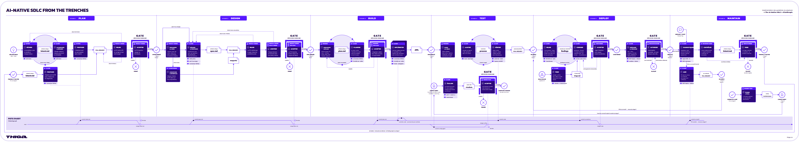

<!-- Converted from thiga-co/dojo-ai-native-sdlc-from-the-tranches (ai-sdlc.html). MIT License, Copyright (c) 2026 Thiga. -->

# Introduction

## Introduction

Ce dojo est né du [playbook AI-Native SDLC d’Anthropic](https://claude.com/blog/the-ai-native-sdlc-playbook). Vous allez vous approprier ce mode de fonctionnement en développant un produit avec Claude Code.

Anthropic part du constat que les agents accélèrent l’écriture du code, mais que les processus qui l’entourent n’ont pas changé au même rythme. Les mêmes validations, reviews, transmissions et politiques freinent les gains obtenus. Le cycle de développement traditionnel, du cadrage à la maintenance, confie chaque phase à un rôle différent et fait passer le travail par des documents, des tickets et des validations. Il a été conçu à une époque où écrire le code était l’étape la plus longue et la plus coûteuse. Les documents d’exigences, les rituels d’estimation et les reviews de sécurité servaient à aligner les équipes pendant des semaines ou des mois de développement.

Quand le code n’est plus le goulot d’étranglement, trois choses deviennent vraies. Le goulot se déplace vers le cadrage, la review et la livraison, qui tournent encore à la vitesse humaine. Les contrôles ne correspondent plus à la réalité, car relire chaque ligne à la main avait un sens quand une personne l’avait écrite. Le coût de gouvernance augmente, car les exceptions passent encore par des comités qui se réunissent chaque semaine ou chaque mois. Une équipe sécurité dimensionnée pour la production humaine en donne l’exemple. Quand les agents multiplient le code, soit la file de review s’allonge, soit le code part sans review, et une organisation réglementée ne peut accepter ni l’un ni l’autre.

Le playbook propose un cycle AI-native qui conserve les objectifs de contrôle existants avec une nouvelle mise en œuvre. Le processus devient une boucle plutôt qu’une ligne, un agent travaille à chaque point, et chaque phase peut déclencher la suivante sans transmission manuelle. La plupart des organisations se situent entre le cycle traditionnel et cette cible. Le playbook est composé de douze plays, des pratiques concrètes réparties dans les six phases, Plan, Design, Build, Test, Deploy et Maintain. Chaque play décrit ce qui change, comment démarrer, les étapes à suivre, la gouvernance et la manière de mesurer le résultat. Les plays sont modulaires et une organisation peut transformer ses phases dans l’ordre qui lui convient.

Vous commencerez par discuter du besoin avec Claude Code. Il le formalisera dans un document que vous relirez et corrigerez. Une fois le besoin accepté, il proposera une conception. Vous la relirez et la validerez avant qu’il prépare le plan de réalisation. Vous examinerez et accepterez ce plan avant de lui confier le développement. L’agent s’appuiera sur ces décisions pour construire le produit et exécuter les contrôles prévus.

  
*Le cycle AI-Native SDLC d’Anthropic en détail*

Vous guiderez le travail de l’agent et déciderez si les résultats permettent de poursuivre. Chaque phase se termine par un artefact enregistré dans le repository, `intent.md`, `spec.md`, `plan.md`, le code et ses tests, la pull request avec ses constats de review, puis l’intention écrite à partir d’un écart mesuré. La phase suivante commence par le lire. Les premières phases produisent des fichiers Markdown, qu’un Product Owner et un agent peuvent lire et modifier ensemble, puis le code prend le relais. La chaîne des commits constitue la piste d’audit, qui a demandé quoi, ce que l’agent a produit et qui l’a approuvé. Une intention acceptée déclenche la conception, une spécification approuvée déclenche le plan, une pull request mergée déclenche le pipeline, et une bande de contrôle franchie écrit la prochaine intention. Au début, chaque étape est lancée à la main. La cible est une boucle où chaque artefact accepté déclenche la suivante, l’attention humaine se concentrant aux points de décision. Les humains restent responsables de chaque décision qui demande un jugement.

## Ce que vous allez construire

Mars Rover est un véhicule d’exploration conçu pour la planète Mars. Une fois sur place, il ne se pilote pas en direct, car le signal met plusieurs minutes à parcourir la distance. L’équipe lui transmet donc une séquence de commandes de déplacement, que le rover exécute seul sur un terrain qui comporte des obstacles.

Vous faites partie de l’équipe qui le construit. Votre mission sera de développer le simulateur qui permet d’essayer une séquence avant de l’envoyer au rover. Il reçoit un point de départ, une carte et une liste de commandes. Il interprète les commandes et affiche la position et la direction finales du rover.

## Prérequis

- ✓Navigateur web
- ✓Abonnement Anthropic

## Modules

1. 01

   [Plan](#plan-ce-que-plan-produit)

   Transformer une idée en intention avec Claude Code

   [Commencer](#plan-ce-que-plan-produit)
2. 02

   [Design](#design-ce-que-design-produit)

   Concevoir la solution avec Claude Code

   [Commencer](#design-ce-que-design-produit)
3. 03

   [Build](#build-ce-que-build-produit)

   Préparer et réaliser le développement avec Claude Code

   [Commencer](#build-ce-que-build-produit)
4. 04

   [Test](#test-ce-que-test-produit)

   Donner à Claude les moyens de vérifier son travail

   [Commencer](#test-ce-que-test-produit)
5. 05

   [Deploy](#deploy-ce-que-deploy-produit)

   Encadrer la review et la livraison du simulateur

   [Commencer](#deploy-ce-que-deploy-produit)
6. 06

   [Maintain](#maintain-ce-que-maintain-produit)

   Refermer le cycle sur un écart mesuré

   [Commencer](#maintain-ce-que-maintain-produit)
7. 07

   [Conclusion](#conclusion-felicitations)

   Vous avez parcouru le cycle complet

   [Commencer](#conclusion-felicitations)
