<!-- Converted from thiga-co/dojo-ai-native-sdlc-from-the-tranches (ai-sdlc.html). MIT License, Copyright (c) 2026 Thiga. -->

# Module 2 · Design

## Introduction

Définition à connaître avant de commencer

**Spécification** : document qui décrit les comportements attendus et les choix de conception permettant de les réaliser.

La phase Plan a produit `intent.md`, accepté par le Product Owner. La phase Design transforme cette intention en une spécification. Claude l’enregistre dans `spec.md`.

La phase Design repose sur un seul play, *Requirements and design*. Il réunit les exigences et la conception dans une même session avec Claude. Le Product Owner guide le travail et relit la proposition. La spécification doit être suffisamment précise pour que l’Engineer puisse préparer le plan de réalisation.

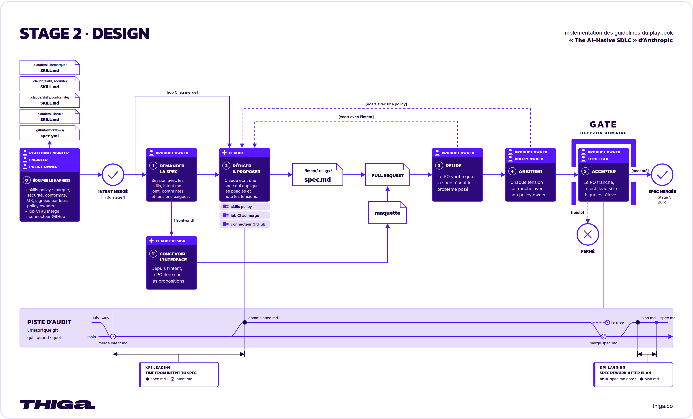  
*La phase Design en détail*

| Cycle traditionnel | Cycle AI-native |
| --- | --- |
| Les exigences et la conception constituent des phases distinctes, prises en charge par des équipes différentes. Les analystes formalisent l’idée en exigences, puis les designers les interprètent pour concevoir une solution. Cette séparation répond à un besoin de responsabilité, mais elle est lente et entraîne des pertes d’information. | Les deux phases se déroulent dans une même session guidée par une demande à Claude. Claude part de `intent.md` et produit une spécification des exigences et de la conception, contrainte par les skills de l’organisation, en signalant les points préoccupants. |

## Dans ce module

Vous préciserez les comportements du simulateur Mars Rover, notamment lorsqu’une commande demande d’avancer vers un obstacle. Vous conserverez les choix retenus et les points encore ouverts dans `intent/mars-rover/spec.md`, à côté de l’intention.

Vous prendrez le rôle du Platform Engineer pour préparer la skill `spec`, puis celui du Product Owner pour guider la conception du simulateur et décider de son acceptation.

## Ce que vous allez faire

1. **Équiper le harness**

   Prendre le rôle du Platform Engineer et préparer la skill `spec` pour guider la rédaction de la spécification et conserver les décisions prises.
2. **Rédiger la spécification**

   Prendre le rôle du Product Owner et demander à Claude de rédiger puis de préciser `spec.md`, jusqu’à proposer en pull request une spécification qui traduit l’intention du simulateur en comportements et choix de conception examinables.
3. **Accepter la spécification**

   Prendre le rôle du Product Owner et décider si la spécification et les décisions tracées permettent de terminer la phase Design et de préparer la réalisation dans la phase Build.

---

## Équiper le harness

L’intention du simulateur est acceptée dans `main`. Vous reprenez le rôle du Platform Engineer.

Le play *Requirements and design* du playbook recommande de rendre les règles de l’organisation disponibles sous forme de skills. Claude peut ainsi proposer une conception qui tient compte des contraintes applicables. La politique est lue et appliquée pendant la rédaction, au lieu d’un conflit découvert des semaines plus tard en review. Le Product Owner dispose d’un accès à Claude sans devoir savoir développer. Sa demande désigne `intent.md`, nomme les contraintes et exige que les points préoccupants soient signalés. L’équipe technique prépare ces instructions, et le Product Owner s’appuie sur elles pour examiner la proposition.

Dans ce dojo, la skill `spec` reprendra les contraintes de Mars Rover et définira les rubriques de `spec.md`. Elle demandera des comportements vérifiables, des scénarios et des réserves explicites. La rubrique « Contexte de génération » conservera aussi la demande adressée à Claude et les versions des skills utilisées.

Passons à la pratique

## À vous de jouer

Objectif

Prendre le rôle du Platform Engineer et préparer la skill `spec` pour guider la rédaction de la spécification et conserver les décisions prises.

01

### Ouvrez une nouvelle session Claude Code.

Prenez le rôle du Platform Engineer pour ajouter la skill `spec`. Cliquez sur Nouveau dans la barre latérale de Claude Code. La nouvelle session doit utiliser l’environnement `Mars Rover`, le repository `mars-rover` et la branche `main`.

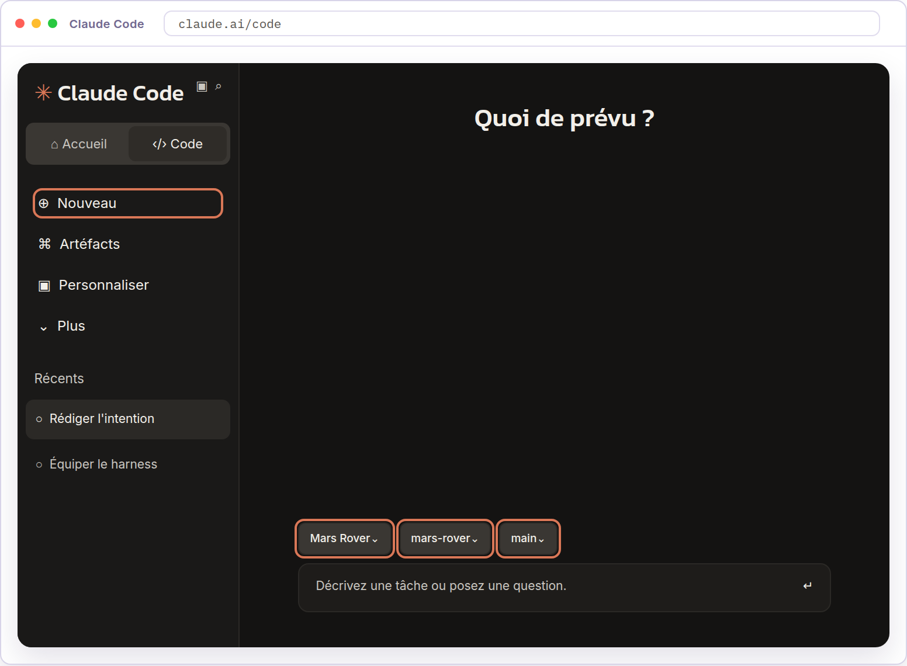

02

### Ajoutez la skill `spec`.

Envoyez ce prompt dans la session que vous venez d’ouvrir. Claude enregistre la skill dans `.claude/skills/spec/SKILL.md`, sur la branche `main` du repository `mars-rover`.

`Crée le fichier .claude/skills/spec/SKILL.md avec exactement le contenu ci-dessous. Ne modifie aucun autre fichier. Commit uniquement ce fichier sur main avec le message « Ajoute la skill spec », puis push ce commit sur main vers GitHub. Ne lance pas la skill.`````` ````md ``````---``name: spec``description: Rédige ou révise la spécification d’une intention acceptée. Décrit les exigences et la conception, signale les réserves et conserve le contexte de génération. S’invoque avec /spec suivi du chemin de l’intent.md.``disable-model-invocation: true``---``# Spec``Rédige la spécification de l’intention désignée par $ARGUMENTS.``Enregistre spec.md dans le même dossier que cette intention.``Le Product Owner relit la proposition et décide de son acceptation.``## Avant de rédiger``- Lis l’intention et vérifie que sa version acceptée est disponible dans la branche main. Sa présence seule ne prouve pas son acceptation. Consulte la décision dans la pull request ; si tu ne peux pas la vérifier, demande au Product Owner de la confirmer.``- Si la session est sur main, crée une branche pour la phase Design depuis la dernière version de main sur GitHub et place-toi dessus avant toute écriture dans intent/. Choisis un nom disponible et respecte les contraintes de nommage de l’environnement. Si la création ou le changement de branche échoue, arrête-toi sans écrire la spécification et explique le problème.``- Si la session est déjà sur une branche de travail, conserve-la pour poursuivre la rédaction ou la révision. Vérifie qu’elle contient la version acceptée de l’intention. Si ce n’est pas le cas, signale-le et attends sa mise à jour avant d’écrire la spécification.``- Si spec.md existe déjà, lis-le et conserve les décisions humaines qui y sont enregistrées. Une demande de révision doit préciser les décisions à réexaminer.``## Rédiger les exigences et la conception``- Reprends le besoin, le périmètre et les contraintes de l’intention acceptée. N’ajoute aucune contrainte produit ou règle d’organisation.``- Donne à chaque exigence un identifiant stable. Indique le comportement attendu et son origine dans l’intention.``- Associe à chaque exigence un scénario avec une situation de départ, une action et un résultat observable. Si le résultat dépend d’une décision encore ouverte, indique ce qui manque au lieu d’inventer la réponse.``- Décris la conception proposée et justifie ses choix au regard du besoin. Distingue les choix déjà acceptés des propositions à valider.``- N’écris ni code ni plan de réalisation. Le découpage des travaux et leur ordre appartiennent à la phase Build.``## Signaler les réserves et suivre les questions``- Signale les ambiguïtés, les informations manquantes et les éventuelles contradictions qui empêchent de préciser la solution. Ne fabrique pas de réserve pour remplir une rubrique.``- Pour chaque réserve, indique son origine, les exigences concernées, ses conséquences et la décision attendue du Product Owner.``- Reprends chaque question ouverte de l’intention. Indique si elle reste ouverte ou si une réponse humaine a été fournie. Une question bloquante doit rester visible avant le passage à la phase Build.``- Après une décision humaine, consigne sa formulation, son auteur lorsqu’il est connu, sa date et sa justification. Mets à jour les exigences, les scénarios et les choix concernés. N’invente ni auteur ni accord.``## Conserver le contexte de génération``- Recopie le prompt exact qui a demandé la spécification dans la rubrique « Contexte de génération ». Pour une invocation /spec, conserve la commande et son argument.``- Liste les chemins des skills réellement utilisées, y compris cette skill. Relève pour chacune l’identifiant du commit Git qui permet de retrouver le contenu utilisé.``- Vérifie que le contenu utilisé correspond à cette version. Si une skill contient des changements non commités ou si sa version ne peut pas être établie, signale-le au lieu d’attribuer une fausse version.``- Lors d’une révision, conserve le contexte initial et ajoute la demande de révision ainsi que les versions des skills utilisées pour cette révision.``## Conduire les décisions``Présente le nom de la branche, le chemin de spec.md, les réserves et les questions qui demandent une décision. Reprends-les ensuite une par une.``Pour chacune, explique ce qui doit être tranché et les conséquences de chaque choix, attends la réponse du Product Owner, puis mets à jour les exigences, les scénarios et les choix concernés. Ne décide jamais à sa place et n’enchaîne pas sur la suivante avant sa réponse.``Une question qu’il ne peut pas trancher reste ouverte. Consigne-la avec son effet sur le passage à la phase Build.``## Enregistrer et proposer``Quand il ne reste plus de point à trancher, arrête-toi et demande si la spécification peut être proposée. N’enregistre rien avant cette réponse.``Une fois acceptée, commit spec.md, push la branche et ouvre la pull request vers main pour la soumettre au Product Owner. Résume les décisions prises et les questions restées ouvertes. Ne déclare pas la spécification acceptée et ne merge pas la pull request.``## Format de spec.md````` ```md `````# Spec : [titre]``Intention de référence : [chemin vers intent.md]``## Périmètre``[Besoin couvert et exclusions présents dans l’intention.]``## Exigences``### EX-01 — [comportement attendu]``Origine dans l’intention : [passage concerné]``Comportement attendu : [exigence vérifiable]``Scénario``- Situation de départ : [conditions connues]``- Action : [action effectuée]``- Résultat attendu : [résultat observable ou décision manquante]``## Conception proposée``[Choix de conception, justification et statut proposé ou accepté.]``## Réserves``[Pour chaque réserve réelle, origine, exigences concernées, conséquences, décision attendue et statut. Après décision, conserver l’auteur connu, la date, la justification et les éléments modifiés. Indiquer « Aucune réserve identifiée » si l’examen n’en révèle aucune.]``## Questions ouvertes``[Suivi de chaque question de l’intention, réponse humaine éventuelle et effet sur le passage à la phase Build.]``## Contexte de génération``### Demande initiale``[Prompt exact ou commande /spec avec son argument.]``### Skills utilisées``| Chemin | Commit Git de la version utilisée |``| --- | --- |``| [chemin du SKILL.md utilisé] | [identifiant vérifié du commit] |``### Révisions``[Lors de chaque révision, ajouter la demande exacte et les versions des skills utilisées.]````` ``` ````````` ```` `````

Cliquez sur les trois points en haut à droite de la session, puis sur Fichiers. Dans le panneau Fichiers, ouvrez `.claude/skills/spec/SKILL.md` et vérifiez que son contenu reprend le texte du prompt.

03

### Lancez `/reload-skills`.

Envoyez `/reload-skills` dans la session Claude Code pour recharger les skills du repository.

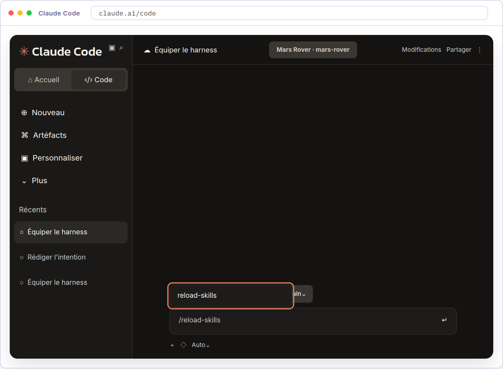

04

### Recherchez `/spec`.

Saisissez `/spec` dans la zone de message sans l’envoyer. Le menu de commandes doit proposer la skill `spec`.

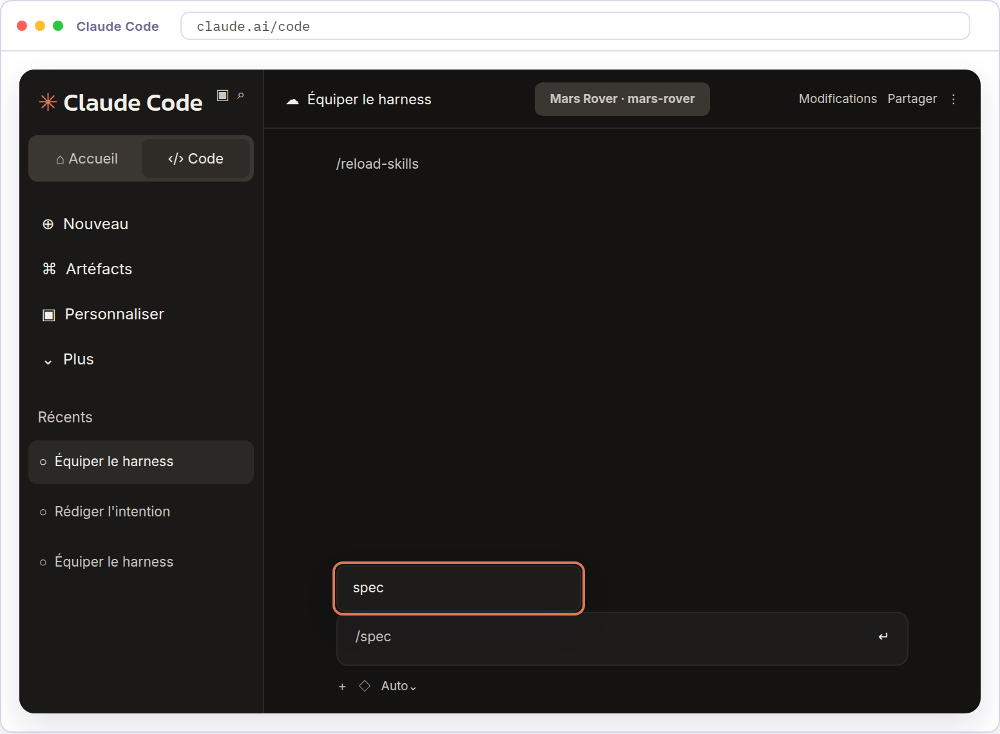

La suggestion `spec` confirme que Claude Code reconnaît la skill.

Application en entreprise

Le dojo utilise une skill pour organiser la rédaction de la spécification. Dans le playbook, les skills portent aussi sur les règles de marque, de sécurité, de conformité et d’expérience utilisateur. Chaque règle a son policy owner, le responsable qui valide son contenu et ses évolutions. Ces politiques d’entreprise ne sont pas installées dans l’exercice.

---

## Rédiger la spécification

L’intention est acceptée et la skill `spec` est disponible. Vous prenez le rôle du Product Owner.

Le play *Requirements and design* du playbook réunit les exigences et la conception dans une même session. Claude décrit les comportements attendus et les scénarios qui permettent de les vérifier, puis propose comment organiser la solution pour les réaliser. Un scénario donne une situation de départ, une action et un résultat vérifiable. Claude signale les ambiguïtés, les informations manquantes et les règles incompatibles sous forme de réserves, en particulier les politiques contradictoires qu’il ne peut pas satisfaire ensemble. Le Product Owner compare les comportements et les choix de conception au besoin. Cette relecture permet de repérer un comportement oublié, une contrainte mal comprise ou un choix qui dépasse le besoin. Le Product Owner fait résoudre les conflits avec les responsables des règles concernées avant de transmettre la spécification à l’équipe technique. L’absence de réserve ne dispense pas de relire le document.

Dans ce dojo, `intent/mars-rover/spec.md` décrira les comportements du simulateur, les choix de conception et les scénarios permettant de les vérifier. Par exemple, une commande d’avancer doit laisser le rover immobile lorsqu’un obstacle bloque son passage. La skill prépare une branche de travail pour conserver cette proposition à côté de l’intention.

Passons à la pratique

## À vous de jouer

Objectif

Prendre le rôle du Product Owner et demander à Claude de rédiger puis de préciser `spec.md`, jusqu’à proposer en pull request une spécification qui traduit l’intention du simulateur en comportements et choix de conception examinables.

01

### Ouvrez une nouvelle session Claude Code.

Prenez le rôle du Product Owner pour demander la spécification à partir de l’intention acceptée. Cliquez sur Nouveau dans la barre latérale. La nouvelle session doit utiliser l’environnement `Mars Rover`, le repository `mars-rover` et la branche `main`.


02

### Rédigez la spécification.

Envoyez cette commande dans la même session pour demander à Claude de rédiger la spécification à partir de l’intention acceptée.

`/spec intent/mars-rover/intent.md`

Claude doit créer une branche pour la phase Design avant d’y écrire `intent/mars-rover/spec.md`. Il indique le nom de la branche et le chemin du fichier. Le document présente les exigences, la conception proposée et les éventuels points à préciser avant son acceptation. La skill présente ensuite les réserves et les questions, puis pose la première. Allez lire le fichier avant d’y répondre.

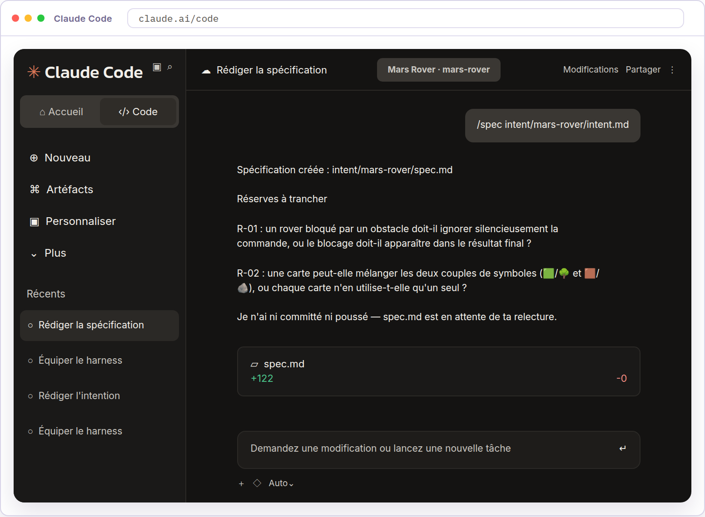

03

### Ouvrez la spécification.

Cliquez sur les trois points en haut à droite de la session, puis sur Fichiers.

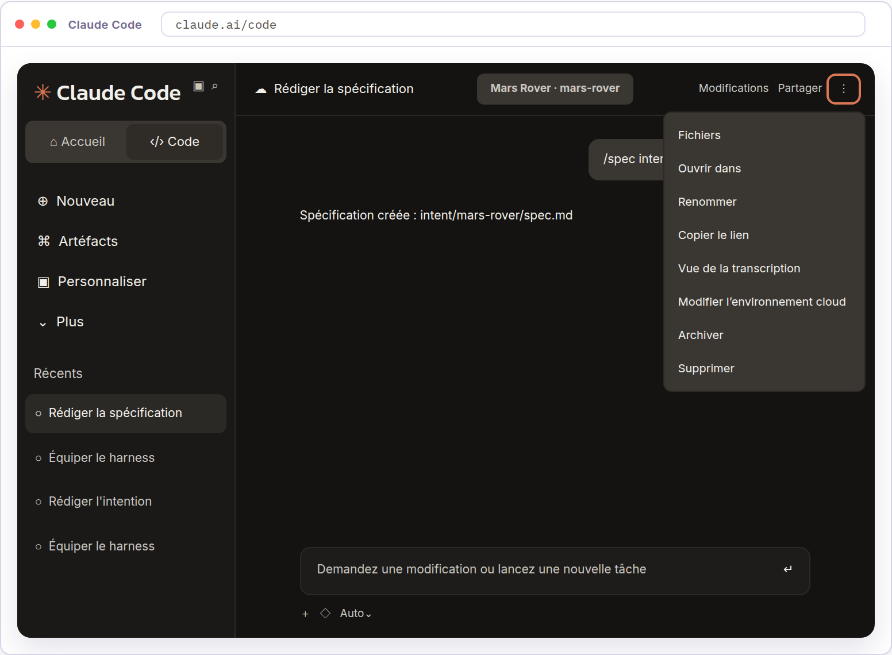

Dans le panneau Fichiers, saisissez `intent/` dans le filtre, puis cliquez sur `spec.md` dans `intent/mars-rover`.

04

### Relisez la spécification.

Lisez `spec.md` dans le panneau Fichiers. Comparez-le à `intent.md`, disponible dans le même dossier.

Vérifiez que les exigences couvrent le besoin et les contraintes de l’intention, que chaque scénario précise une situation de départ, une action et un résultat vérifiable, et que les choix de conception restent dans le périmètre du simulateur. Les réserves et les questions ouvertes doivent être compréhensibles.

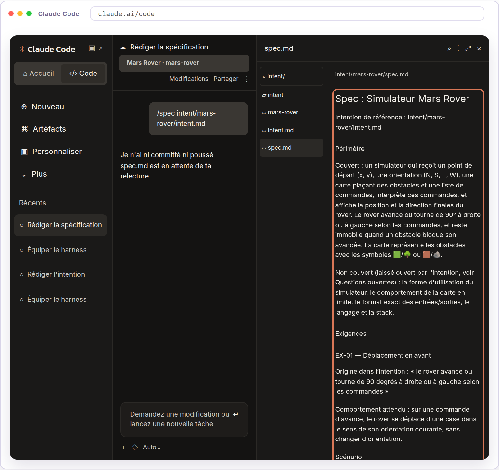

Repérez les écarts et les points à préciser pour les reprendre avec Claude.

05

### Répondez aux questions de la skill.

La skill reprend les réserves et les questions une par une. Répondez à partir de l’intention acceptée et des contraintes du simulateur. Elle inscrit vos décisions dans la spécification et ajuste les exigences et les scénarios concernés.

Si vous ne pouvez pas trancher une question, envoyez ce message.

`Je ne peux pas encore répondre à cette question. Garde-la ouverte dans la spécification et indique si elle bloque le passage à la phase Build.`

Vérifiez que vos décisions figurent dans les passages modifiés.

06

### Vérifiez le contexte de génération.

Toujours dans le rôle du Product Owner, vérifiez le contexte de génération de la spécification. Dans `spec.md`, descendez à la rubrique Contexte de génération. Vérifiez qu’elle contient votre demande, le chemin des skills utilisées et le commit Git correspondant à leur version. Si vous avez fait modifier la spécification, vérifiez aussi que les demandes de révision y figurent.

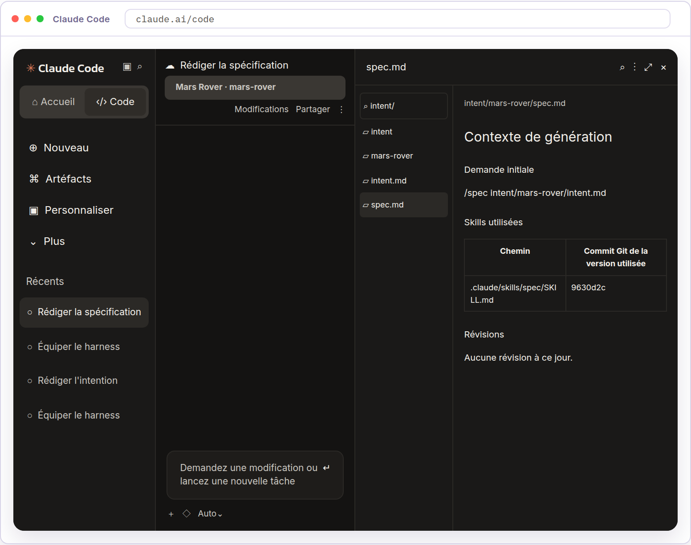

Si une information manque ou ne correspond pas à votre session, demandez à Claude de corriger cette rubrique avant d’ouvrir la pull request.

07

### Proposez la spécification.

La skill demande si la spécification peut être proposée. Acceptez dans la conversation.

`La spécification peut être proposée.`

Claude fournit le lien de la pull request. La spécification est proposée à la relecture dans GitHub, elle n’est pas encore acceptée dans la branche `main`.

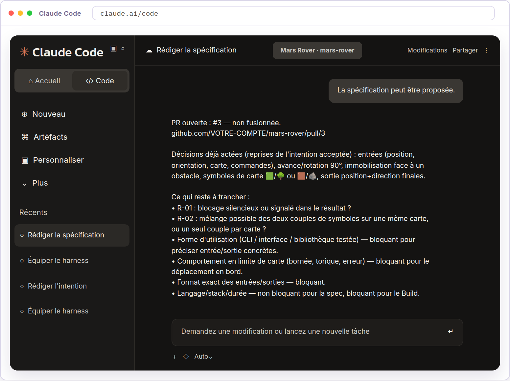

Application en entreprise

Pour une interface graphique, le play illustre la conception par une maquette réalisée dans Claude Design à partir de `intent.md`, affinée avec le Product Owner puis exportée vers Claude Code pour la réalisation. Le simulateur n’a pas d’interface graphique et le dojo ne reprend pas cet exemple.

---

## Accepter la spécification

La spécification du simulateur est proposée dans une pull request vers `main`. Vous conservez le rôle du Product Owner.

Le play *Requirements and design* du playbook confie au Product Owner la décision de passer à la phase Build. Il vérifie la fidélité à l’intention et le traitement des réserves. Les conflits avec les règles de l’organisation doivent être résolus avec leurs responsables avant de poursuivre. Une question sans effet sur la réalisation prévue peut rester ouverte si son report et ses conséquences sont explicités dans la spécification. Les changements jugés à risque élevé appellent aussi l’avis d’un responsable technique. Le fichier `spec.md` est conservé à côté de `intent.md`, et la paire enregistre ce qui a été demandé et ce qui a été décidé. La spécification, la demande adressée à Claude et les versions des skills en vigueur sont versionnées ensemble. L’acceptation par le Product Owner démarre la préparation du plan de la phase Build.

Dans ce dojo, la pull request réunit `spec.md` et son contexte de génération, avec la demande adressée à Claude et les versions des skills utilisées. Ces éléments permettent de comprendre et de réexaminer la décision. Le merge dans `main` rendra la spécification acceptée disponible pour préparer le plan de réalisation.

Passons à la pratique

## À vous de jouer

Objectif

Prendre le rôle du Product Owner et décider si la spécification et les décisions tracées permettent de terminer la phase Design et de préparer la réalisation dans la phase Build.

01

### Ouvrez la pull request dans GitHub.

Toujours dans le rôle du Product Owner, cliquez sur le lien de la pull request fourni par Claude. Lisez le résumé, les décisions prises et les points encore ouverts.

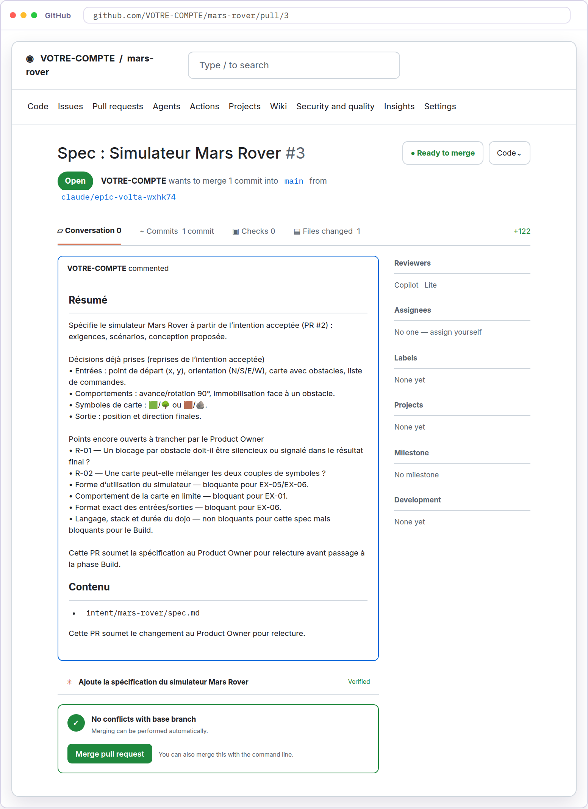

02

### Examinez les modifications.

Ouvrez l’onglet Files changed pour examiner la version de `spec.md` proposée dans la pull request. Vérifiez qu’elle reprend les corrections et les décisions prises avec Claude.

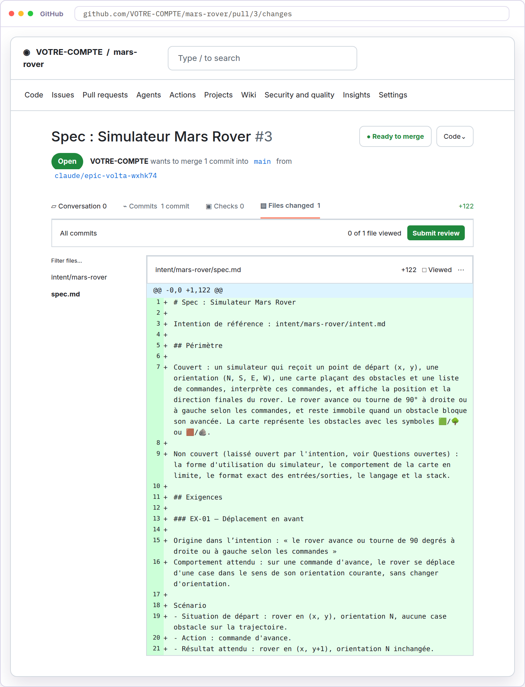

03

### Acceptez la spécification.

Décidez si la spécification permet de préparer la réalisation. Si vous demandez des corrections, demandez à Claude de corriger la spécification et de mettre à jour la même pull request, puis examinez de nouveau la PR dans GitHub.

Lorsque vous acceptez la spécification, revenez dans l’onglet Conversation. Descendez jusqu’au bouton Merge pull request et cliquez dessus, puis confirmez avec Confirm merge.

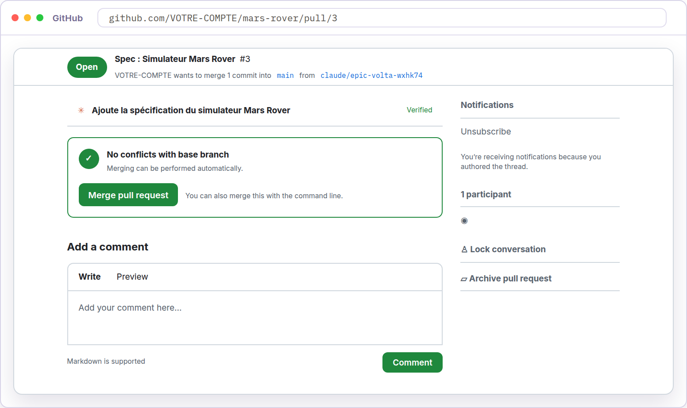

Le merge enregistre votre acceptation. `intent/mars-rover/spec.md` est disponible dans la branche `main`, avec l’intention acceptée. Vous utiliserez ces deux documents dans la phase Build pour préparer le plan de réalisation.

Application en entreprise

Le play propose de lancer la demande à la main, puis de la transformer en commande partagée de l’organisation. Une équipe peut ensuite faire de l’acceptation de `intent.md` le déclencheur, avec une tâche non interactive qui part au merge, charge les skills et propose `spec.md` dans une PR. Le Product Owner intervient alors d’abord pour la review. Le dojo lance la commande `/spec` à la main. La configuration de cette automatisation relève de la phase Deploy.
