<!-- Converted from thiga-co/dojo-ai-native-sdlc-from-the-tranches (ai-sdlc.html). MIT License, Copyright (c) 2026 Thiga. -->

# Module 3 · Build

## Introduction

La phase Design a produit `spec.md`, accepté par le Product Owner. La phase Build transforme cette spécification en code et en tests.

Cette phase s’appuie sur quatre plays. *Claude Code plan mode as the default starting point* fait précéder le code d’un plan écrit. *The CLAUDE.md* donne à Claude les repères du projet. *Skills as institutional knowledge* lui donne les méthodes de l’organisation. *Parallel sessions and subagents* permet à un Engineer de piloter plusieurs travaux à la fois.

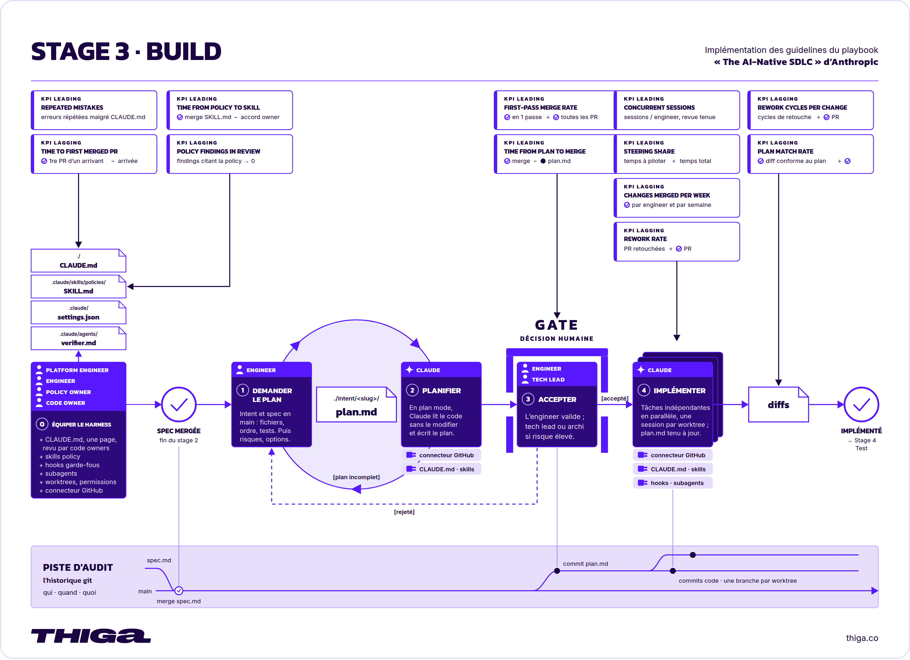  
*La phase Build en détail*

Le play *Claude Code plan mode as the default starting point* du playbook recommande de commencer par un plan de réalisation. Claude lit l’intention, la spécification et le repository. Il propose les fichiers à modifier, l’ordre du travail et les tests qui permettront de vérifier le résultat. L’Engineer examine cette stratégie avant d’autoriser la réalisation. Le plan accepté est conservé dans `plan.md` pour guider le travail et sa review.

| Cycle traditionnel | Cycle AI-native |
| --- | --- |
| Un Engineer lit la conception et commence à écrire le code. La manière de réaliser le changement, jusqu’aux fichiers concernés et aux tests, reste dans sa tête ou, au mieux, dans un commentaire de ticket. Personne d’autre ne peut l’examiner. La première chose que voit une personne chargée de la review est le diff terminé. À ce stade, reprendre le travail est lent. | Le travail commence par un plan écrit que Claude produit en mode Plan, dans lequel il peut lire le code sans rien modifier. L’Engineer corrige le plan avant l’écriture du code. La version approuvée est ensuite enregistrée dans Git sous le nom `plan.md`, afin que les phases suivantes puissent s’y référer pour leurs vérifications. |

Le play *Parallel sessions and subagents* du playbook change ensuite la façon dont l’Engineer occupe son temps.

| Cycle traditionnel | Cycle AI-native |
| --- | --- |
| Un Engineer travaille sur une tâche à la fois et passe une part importante de sa journée ou de sa semaine dans les builds, les tests et les reviews. Changer de tâche pendant l’attente est possible, mais le changement de contexte est assez fatigant pour que peu de personnes le choisissent. | Un Engineer fait tourner plusieurs sessions Claude en même temps, chacune dans son propre worktree, une copie de travail du repository, sur sa propre tâche. Les travaux répétés deviennent des sous-agents, des assistants à contexte propre au sein d’une session, avec leurs limites d’outils. Le travail de l’Engineer se déplace vers l’orchestration, puis vers la construction et la surveillance de boucles. |

## Dans ce module

Vous obtiendrez le code du simulateur Mars Rover et des tests de ses comportements, à partir de la spécification acceptée. Le plan sera conservé dans `intent/mars-rover/plan.md`. Vous comparerez le résultat à la spécification et au plan pour décider des corrections nécessaires.

Vous prendrez le rôle de l’Engineer pour préparer et piloter la réalisation du simulateur. Vous prendrez aussi celui du Platform Engineer pour ajouter une méthode partagée de rédaction du code.

## Ce que vous allez faire

1. **Équiper le harness**

   Prendre le rôle de l’Engineer pour préparer `CLAUDE.md`, puis celui du Platform Engineer pour ajouter la skill `clean-code`, et donner ainsi à Claude les instructions qui guideront la réalisation.
2. **Rédiger le plan**

   Prendre le rôle de l’Engineer et demander à Claude de préciser le plan du simulateur pour examiner les travaux et les tests avant d’autoriser la réalisation.
3. **Implémenter**

   Prendre le rôle de l’Engineer et piloter la réalisation du plan accepté pour obtenir le code du simulateur et examiner ses vérifications avant de terminer la phase Build.

---

## Équiper le harness

La spécification de Mars Rover est acceptée. Vous prenez le rôle de l’Engineer pour préparer `CLAUDE.md`, puis celui du Platform Engineer pour ajouter la skill `clean-code`.

Le play *The CLAUDE.md* du playbook recommande de fournir les repères dont une personne rejoignant le projet aurait besoin dès le premier jour. Un Engineer qui connaît le projet les rassemble dans `CLAUDE.md`, à la racine du repository, lu par Claude Code au début de chaque session. Le fichier garde les commandes de construction, de test et de contrôle du code, les conventions qui comptent, les repères d’architecture et les erreurs que Claude répète. Une règle simple l’entretient, quand Claude se trompe deux fois, la correction entre dans `CLAUDE.md`. Le fichier reste sous une page, car Claude le lit en entier à chaque session et une instruction obsolète occupe du contexte sans bénéfice.

Le play *Skills as institutional knowledge* du playbook complète ces repères par des méthodes réutilisables. Une skill convient à un savoir partagé qui doit être appliqué de manière cohérente, par exemple un standard de sécurité, une convention d’API ou une règle de marque. Une demande ponctuelle reste dans un prompt, et les instructions propres au projet dans `CLAUDE.md`. Le play part d’une règle écrite et d’un responsable identifié, le policy owner. Un Engineer transcrit la règle, avec l’aide de Claude, dans un dossier contenant `SKILL.md`, dont les métadonnées disent quand la skill se déclenche et le corps ce qu’il faut faire. Le déclenchement se vérifie en formulant la tâche de plusieurs façons. Quand la règle change, la skill change et le policy owner approuve la modification. Les Engineers récupèrent la nouvelle version à leur prochaine session.

Dans ce dojo, `CLAUDE.md` conservera les conventions, les repères du projet et les corrections aux erreurs récurrentes. La skill `clean-code`, fondée sur les règles de Robert C. Martin, guidera l’écriture et la relecture du code. Les commandes de vérification seront précisées avec la réalisation, car le repository contient encore surtout des documents.

Passons à la pratique

## À vous de jouer

Objectif

Prendre le rôle de l’Engineer pour préparer `CLAUDE.md`, puis celui du Platform Engineer pour ajouter la skill `clean-code`, et donner ainsi à Claude les instructions qui guideront la réalisation.

01

### Ouvrez une nouvelle session Claude Code.

Prenez le rôle de l’Engineer pour préparer les instructions du projet. Cliquez sur Nouveau dans la barre latérale de Claude Code. La nouvelle session doit utiliser l’environnement `Mars Rover`, le repository `mars-rover` et la branche `main`.

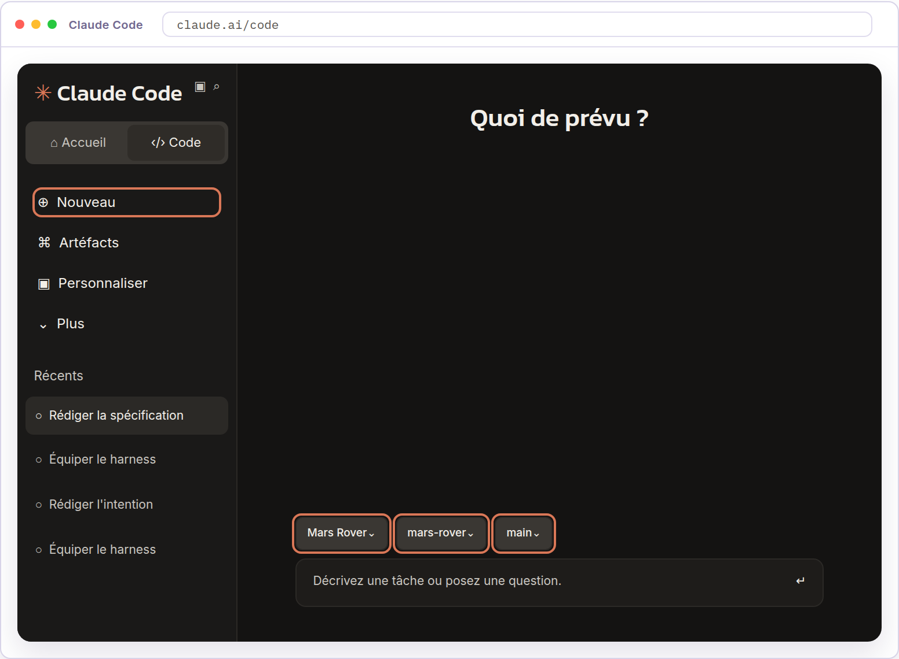

02

### Initialisez le fichier `CLAUDE.md`.

Dans la session que vous venez d’ouvrir, saisissez la commande suivante.

`/init`

La commande `/init` demande à Claude d’examiner le repository pour préparer un premier fichier `CLAUDE.md`. Ce fichier Markdown rassemble les instructions que Claude suivra dans le repository.

Le contenu dépend des fichiers présents. À ce stade, Claude dispose de l’intention, de la spécification et des skills ajoutées dans les modules précédents.

Le résultat attendu est un fichier `CLAUDE.md` à la racine du repository.

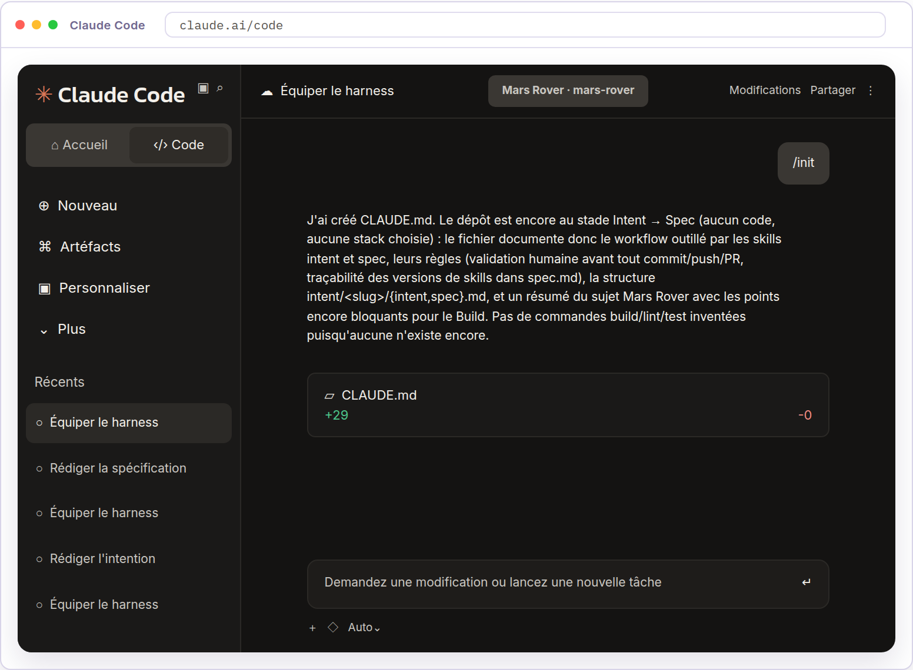

03

### Ouvrez le fichier `CLAUDE.md`.

Cliquez sur les trois points en haut à droite de la session, puis sur Fichiers.

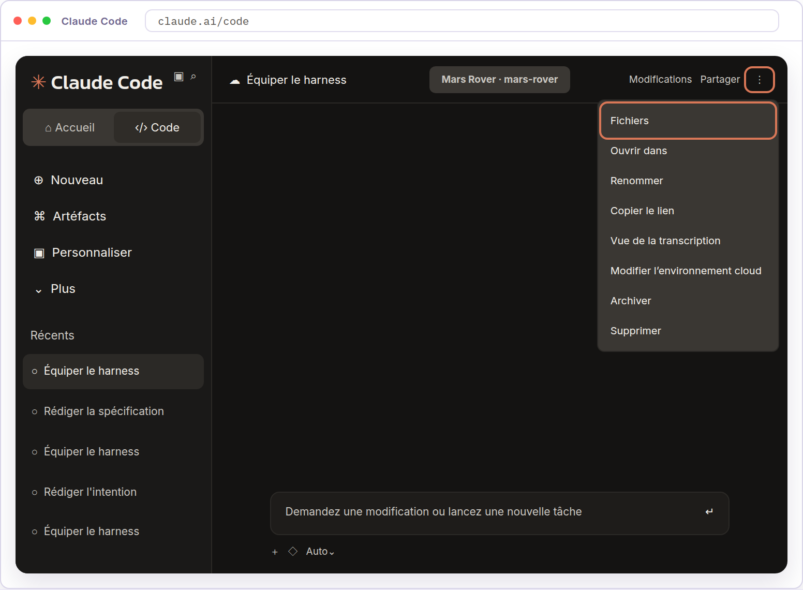

Dans le panneau Fichiers, cliquez sur `CLAUDE.md` à la racine du repository.

04

### Relisez les instructions de `CLAUDE.md`.

Lisez `CLAUDE.md` dans le panneau Fichiers. Vérifiez qu’il décrit les documents et les skills du repository, que ses conventions correspondent à `spec.md`, et qu’aucune instruction ne contredit l’intention ou la spécification acceptées. Les commandes de construction et de test sont absentes ou signalées à compléter, le repository ne contenant pas encore de code.

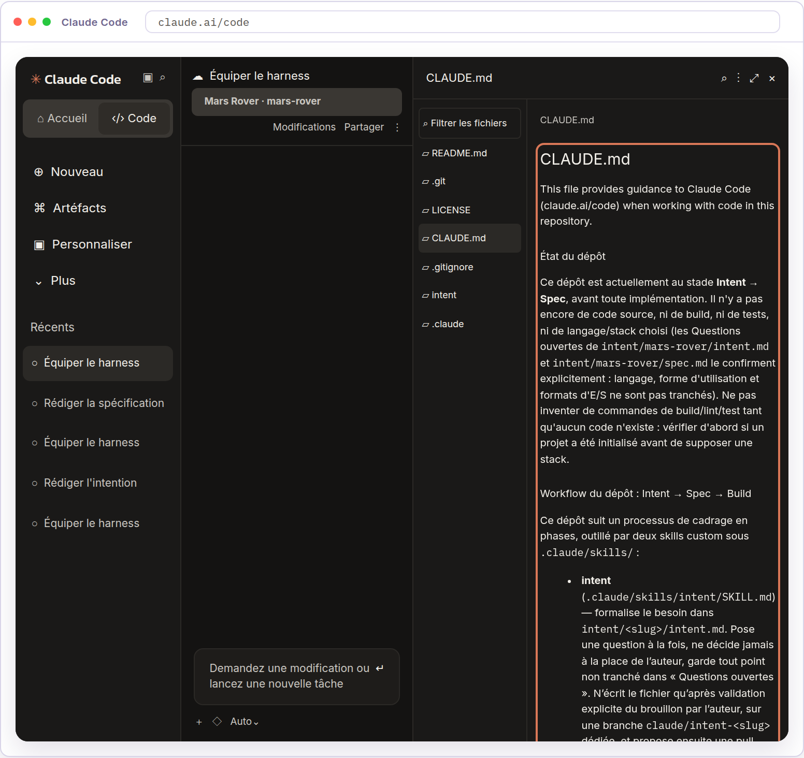

Dans le fichier généré ici, Claude décrit les documents et les skills présents. Il ne précise pas encore les commandes de build ou de test. Cette absence de commandes est cohérente avec l’état du repository.

05

### Ajoutez la règle sur les erreurs récurrentes.

Envoyez ce prompt dans la session Claude Code pour ajouter la règle à la fin de `CLAUDE.md` et enregistrer le fichier.

`Ajoute à la fin de CLAUDE.md la section délimitée ci-dessous, sans modifier``le reste du fichier.````` ```md `````## Erreurs récurrentes``Lorsqu’une même erreur se répète deux fois, propose une instruction courte et précise pour l’éviter. Appuie-toi sur les erreurs observées et fais valider cette instruction avant de l’ajouter à CLAUDE.md.``Si une instruction devient obsolète, propose sa correction ou son retrait et attends la validation avant de modifier le fichier.````` ``` `````Commit ensuite uniquement CLAUDE.md sur main avec le message « Ajoute les``instructions du projet », puis push ce commit sur main vers GitHub. Ne``modifie aucun autre fichier.`

Claude fait le commit de `CLAUDE.md` sur `main` et le push de la branche, puis indique la référence du commit.

Dans le panneau Fichiers, vérifiez que la section Erreurs récurrentes figure à la fin de `CLAUDE.md` et reprend le texte demandé.

06

### Ajoutez la skill `clean-code`.

Prenez le rôle du Platform Engineer pour ajouter la skill `clean-code`. Envoyez ce prompt dans la session Claude Code où vous avez préparé `CLAUDE.md`.

`Crée le fichier .claude/skills/clean-code/SKILL.md avec exactement``le contenu ci-dessous. Ne modifie aucun autre fichier.``Commit uniquement ce fichier sur main avec le message « Ajoute la skill clean-code »,``puis push ce commit sur main vers GitHub. Ne lance pas la skill.`````` ````md ``````---``name: clean-code``description: >-` `Applique les principes Clean Code lors de la planification, de` `l’implémentation et de la relecture du code. À utiliser aussi pour` `proposer des critères de lisibilité à partir d’une spécification ou` `identifier les erreurs de nommage, de responsabilité et de complexité` `à éviter avant la réalisation.``---``# Appliquer Clean Code de Robert C. Martin``## Quand utiliser cette skill``Utilise cette skill lorsque la lisibilité, la compréhension locale et la maintenabilité du code sont les préoccupations principales, notamment pendant l’implémentation et la relecture courantes.``## Biais à corriger``Un code qui fonctionne n’est pas automatiquement un code propre.``## Règles de décision``- Intègre la propreté du code à la livraison. Préserve le comportement et améliore le code touché dans le périmètre demandé. Un délai serré ou une réécriture promise ne justifie pas d’ajouter du désordre.``- Facilite la compréhension locale. Le lecteur doit pouvoir suivre le cheminement sans reconstituer un état caché, naviguer entre des portions éloignées ou décoder des conventions de nommage obscures.``- Utilise des noms précis et un seul terme par concept. Renomme ce qui masque l’intention, porte plusieurs sens ou nécessite des commentaires compensatoires.``- Garde les fonctions petites, ciblées et à un seul niveau d’abstraction. Présente l’intention avant les détails, dans une lecture de haut en bas.``- Limite les paramètres et donne-leur un sens clair. Évite les indicateurs booléens, les paramètres de sortie et les listes d’arguments hétéroclites. Modélise le concept qu’ils représentent.``- Sépare les commandes des requêtes et supprime les effets de bord cachés. Une fonction qui répond à une question ne doit pas modifier l’état à l’insu du lecteur.``- Garde le parcours nominal lisible. Isole la gestion des erreurs, des états invalides et du nettoyage des ressources. Préfère une absence explicite ou des résultats typés aux valeurs sentinelles de type null lorsque le langage le permet.``- Expose les comportements plutôt que la représentation interne. Évite les chaînes d’accès en cascade, les modules utilitaires fourre-tout et les classes ou modules aux responsabilités mélangées.``- Garde les détails de construction, de framework, de persistance, de transaction, de sécurité et de fournisseurs externes en dehors du comportement métier.``- Conçois des API publiques réduites, explicites et difficiles à mal utiliser. Rends visibles la logique aux frontières, l’ordre requis des opérations et les points de changement probables.``- Réserve les commentaires aux raisons des choix, aux contraintes, aux avertissements et aux contrats externes. Ne commente pas le déroulement du code au lieu de l’améliorer.``- Traite les tests comme du code de production. Ils doivent être lisibles, déterministes et alignés sur le comportement ou le contrat protégé. Effectue une validation proportionnée avant de déclarer la modification terminée.``- Laisse la conception émerger des tests, de la suppression des duplications, de l’expressivité et d’une structure minimale. N’ajoute pas d’abstractions ou d’infrastructure inutiles.``- Dans le code touché, corrige le défaut qui augmente le plus le coût des changements. Ne dépasse pas silencieusement le plus petit nettoyage nécessaire pour rendre la modification demandée sûre.``## Déclencheurs``- Lorsqu’une fonction mélange préparation, validation, calcul et effets de bord, sépare ces phases.``- Lorsqu’un commentaire explique le flux de contrôle, simplifie les noms ou la structure avant de le conserver.``- Lorsqu’une fonction modifie l’état tout en renvoyant une réponse, ou cache un changement de mode derrière un indicateur, sépare les responsabilités.``- Lorsque des duplications, des branchements répétés ou des groupes de valeurs primitives apparaissent, nomme le concept avec un objet de paramètres, du polymorphisme, un cas particulier ou une autre petite abstraction.``- Lorsqu’une frontière laisse entrer les particularités d’un framework, d’un fournisseur ou de la persistance, ajoute ou renforce un adaptateur local.``- Lorsque l’asynchronisme ou la concurrence intervient, isole la politique d’exécution des threads, minimise l’état mutable partagé, définis l’arrêt et teste les comportements sensibles au timing.``- Lorsque tu corriges un bug ou modifies un comportement, ajoute ou mets à jour le test qui protège le contrat attendu.``- Lorsque le nettoyage s’étend à des zones sans rapport avec la demande, reviens au plus petit refactoring qui garde la modification sûre et lisible.``## Vérification finale``- Le lecteur peut-il comprendre la modification localement ?``- Les noms et les API portent-ils le sens sans commentaire narratif ?``- Les mutations sont-elles explicites et le parcours nominal reste-t-il clair ?``- Les détails de framework, de persistance, de fournisseurs et de construction restent-ils derrière leurs frontières ?``- Ai-je supprimé au moins un défaut de conception dans la zone touchée ?``- Les tests protègent-ils le comportement ou le contrat modifié ?``- Ai-je réellement exécuté les tests ou vérifications pertinents pour cette modification ?`````` ```` `````

Ouvrez `.claude/skills/clean-code/SKILL.md` dans le panneau Fichiers. Vérifiez que son contenu reprend le texte du prompt.

07

### Lancez `/reload-skills`.

Envoyez `/reload-skills` dans la session Claude Code pour recharger les skills du repository.


08

### Recherchez `/clean-code`.

Saisissez `/clean-code` dans la zone de message sans l’envoyer. Le menu de commandes doit proposer la skill `clean-code`.

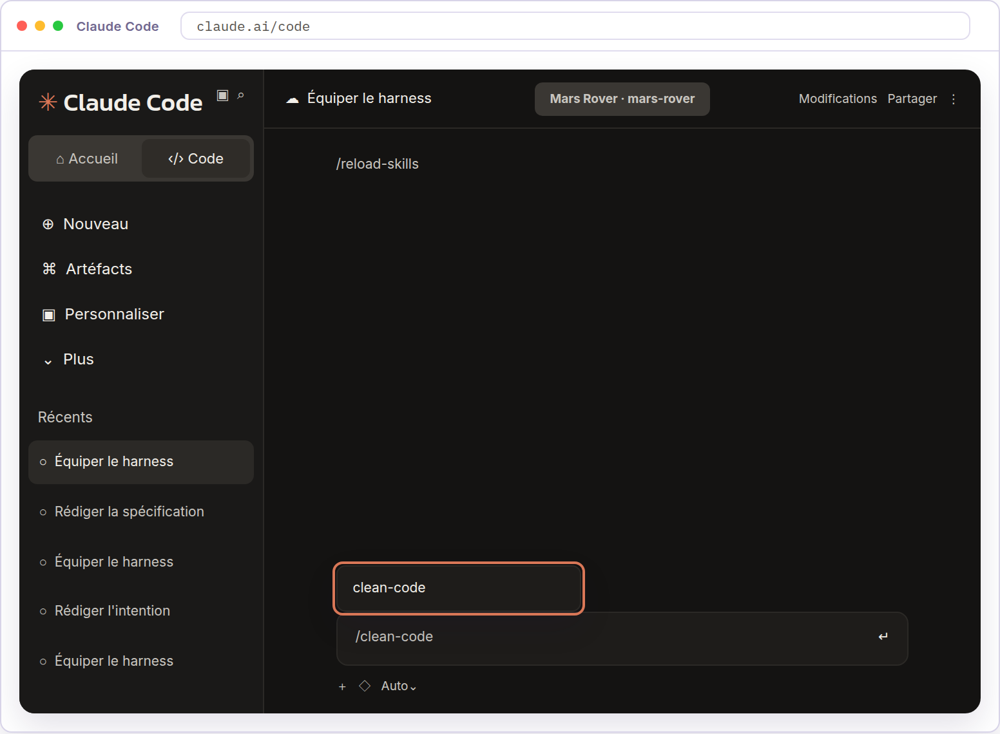

La suggestion `clean-code` confirme que Claude Code reconnaît la skill.

Application en entreprise

Le dojo ajoute des instructions dans `CLAUDE.md` et dans des skills, relues puis enregistrées directement dans `main`. Dans une équipe, ces changements sont tracés dans Git et approuvés par un Code Owner en review de PR, comme du code. Les skills peuvent être conservées dans le repository sous `.claude/skills/<nom>/` ou distribuées à toute l’organisation par un plugin.

Une skill guide Claude sans garantir qu’il respecte chaque règle. Une règle qui doit toujours tenir demande un contrôle déterministe derrière la skill, un hook, script que Claude Code exécute avant une action et qui peut la refuser, ou une review qui la vérifie à la PR. Les invocations de skills figurent dans les traces de session et chaque policy owner relit les évolutions de sa règle.

Les hooks de la phase Build peuvent protéger des chemins comme les classes générées, exécuter un formateur ou un contrôle de code après une modification, et empêcher l’ajout de secrets. Ils doivent rester rapides et limités au fichier modifié. Les suites de tests lourdes se placent au commit ou à la PR, et un hook qui demande une approbation humaine relève des gates de la phase Deploy, pour ne pas remettre une personne sur le chemin critique des sessions parallèles. Aucun hook n’est installé avant la phase Test.

---

## Rédiger le plan

L’intention, la spécification et les instructions du projet sont disponibles dans `main`. Vous reprenez le rôle de l’Engineer.

Le play *Claude Code plan mode as the default starting point* du playbook recommande de préparer un plan avant d’écrire le code. L’Engineer ouvre la session en mode Plan, où Claude lit le repository sans rien modifier, et lui donne `intent.md` et `spec.md`. Claude l’interroge et propose les fichiers à modifier, l’ordre du travail et les tests qui prouveront le résultat, avec les risques identifiés. L’Engineer vérifie que le plan couvre les exigences de `spec.md`. Il demande à Claude ce que le changement pourrait casser, quelle partie présente le plus de risques et quelles autres solutions ont été écartées. Le plan doit pouvoir être repris par un autre Engineer sans avoir assisté à la session. Ses révisions et la personne qui l’accepte restent traçables. Les changements courants sont approuvés par l’Engineer. Un Tech Lead ou un architecte intervient pour ceux que l’organisation juge à risque élevé.

Dans ce dojo, le plan reliera les comportements de Mars Rover aux travaux et aux tests prévus, notamment l’arrêt devant un obstacle, dans les quatre rubriques de l’exemple du playbook, fichiers modifiés, ordre du travail, risques et preuve. Il sera précisé sur la branche de build avant la décision d’acceptation.

Passons à la pratique

## À vous de jouer

Objectif

Prendre le rôle de l’Engineer et demander à Claude de préciser le plan du simulateur pour examiner les travaux et les tests avant d’autoriser la réalisation.

01

### Ouvrez une nouvelle session Claude Code.

Reprenez le rôle de l’Engineer pour demander le plan à partir de la version acceptée de `spec.md`. Cliquez sur Nouveau dans la barre latérale. La nouvelle session doit utiliser l’environnement `Mars Rover`, le repository `mars-rover` et la branche `main`.

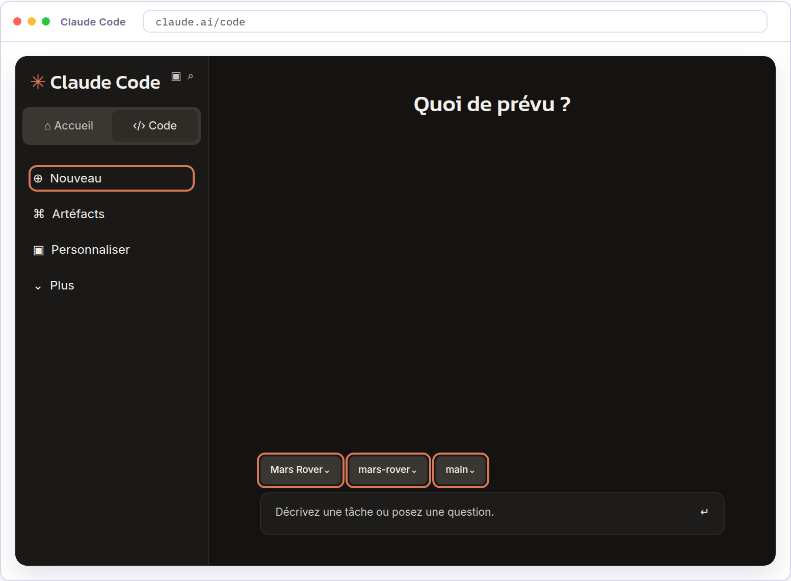

02

### Créez la branche de build.

Envoyez ce prompt à Claude pour créer la branche qui portera le plan et la réalisation du simulateur.

`Crée une branche pour la phase Build depuis la dernière version de main et place-toi dessus.`

Claude indique le nom de la branche créée.

03

### Activez le mode Plan.

Cliquez sur Auto sous la zone de message de Claude Code. Choisissez Plan dans le menu.

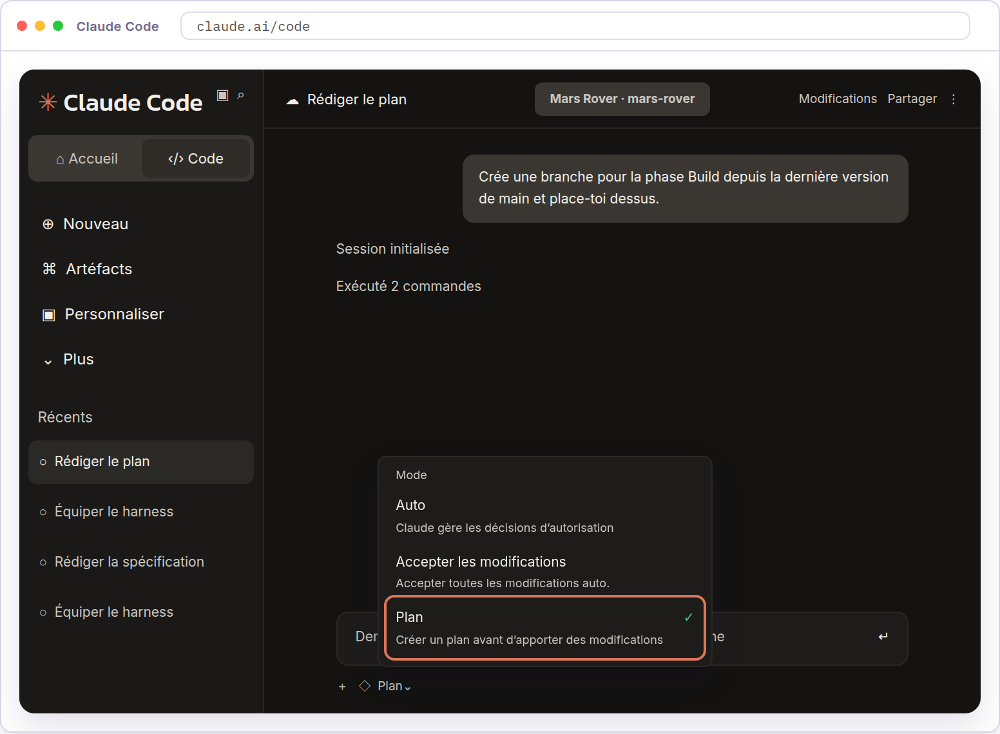

Le sélecteur doit afficher Plan. Dans ce mode, Claude explore le repository et prépare un plan sans modifier le code source.

04

### Demandez le plan de réalisation.

Envoyez ce prompt dans la même session, en mode Plan.

`Lis @intent.md et @spec.md, puis propose un plan de réalisation du simulateur. Précise les fichiers à créer ou modifier, l’ordre du travail et les tests prévus.``Prévois comme première étape d’enregistrer le plan dans plan.md à côté de ces deux fichiers et de commiter uniquement ce fichier.`

Claude peut vous poser des questions avant de proposer le plan. Dans cet exemple, il demande des précisions sur les obstacles, les symboles de la carte et les limites de la grille. Les questions dépendent de votre `spec.md`.

Si la réponse figure déjà dans `spec.md`, rappelez la décision à Claude. Si un comportement reste à définir, demandez au Product Owner de le trancher, puis à Claude de consigner la décision dans `spec.md` avant de poursuivre le plan. La mention « recommandé » indique la préférence de Claude, pas une décision déjà acceptée.

Pour chaque question, choisissez la réponse qui correspond à la décision retenue. Utilisez Autre pour la préciser avec vos mots. Cliquez sur Suivant pour passer à la question suivante.

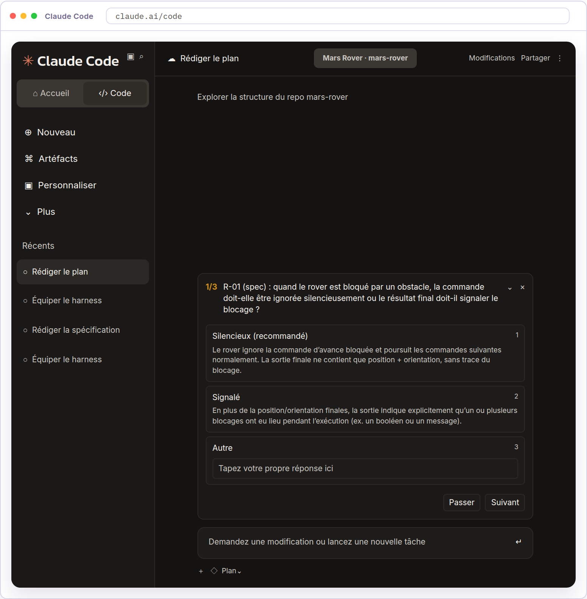

Cliquez sur Envoyer après la dernière réponse. Claude peut poursuivre la préparation du plan. Répondre à ses questions n’autorise pas encore l’implémentation.

05

### Relisez le plan.

Comparez le plan à la version acceptée de `spec.md`.

Vérifiez que les tâches couvrent les exigences et respectent les décisions de `spec.md`, que le rôle des fichiers, l’ordre des tâches et leurs dépendances sont clairs, et que les tests précisent les comportements vérifiés et les résultats attendus. Les choix encore ouverts et les points à corriger doivent rester identifiables.

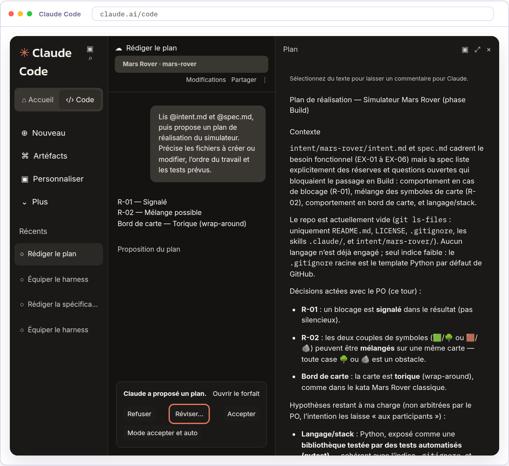

06

### Révisez le plan.

Cliquez sur Réviser…, puis envoyez le message suivant. Remplacez `[points à préciser ou à corriger]` par les points relevés pendant votre relecture. Si vous n’avez relevé aucun point, retirez cette ligne du prompt.

`Reprenons les points suivants du plan un par un :``[points à préciser ou à corriger]``Examine aussi ce que ce changement pourrait casser, l’étape la plus``risquée et les autres solutions envisagées.``Pour chaque point, explique-moi les conséquences des choix proposés,``attends ma réponse, puis mets à jour le plan.`

Vérifiez que les corrections et les précisions figurent dans le plan. Les risques doivent être reliés aux travaux et aux tests prévus, et les solutions écartées expliquées.

---

## Implémenter

Définitions à connaître avant de commencer

**Sous-agent** : assistant chargé d’une mission précise au sein d’une session, avec son propre contexte et un ensemble d’outils autorisés.

**Session parallèle** : session Claude Code distincte qui travaille sur une autre tâche sans partager la conversation des autres sessions.

**Worktree** : copie de travail supplémentaire d’un repository Git, associée à une branche distincte pour préparer des changements en parallèle.

Le plan du simulateur est relu et précisé, sans être encore accepté. Vous conservez le rôle de l’Engineer.

Le play *Claude Code plan mode as the default starting point* du playbook recommande de réaliser le changement à partir du plan approuvé. Un commit enregistre le plan dans `plan.md` avant le code, pour rejoindre la piste d’audit et servir à la review de la PR dans la phase Deploy. Avec un plan solide, la réalisation tient souvent en un seul passage, sans que ce soit une garantie. Claude écrit le code et les tests, exécute les vérifications et corrige les erreurs observées. L’Engineer examine le résultat, la portée des tests et les écarts au plan. Un test réussi apporte une preuve sur le cas qu’il couvre. Le compte rendu doit aussi signaler ce qui n’a pas été vérifié. Si la réalisation s’écarte du plan, `plan.md` est mis à jour dans le même commit que le code concerné. L’Engineer décide des ajustements techniques. Une modification du besoin demande une décision du Product Owner et une mise à jour de la spécification.

Le play *Parallel sessions and subagents* du playbook distingue la session parallèle, une autre instance complète de Claude Code sur une autre tâche, et le sous-agent, un assistant à l’intérieur d’une session avec son propre contexte et des outils limités. Un sous-agent convient aux travaux qui reviennent d’une tâche à l’autre. Sa définition donne un nom, les circonstances d’utilisation et les outils autorisés. L’exemple du playbook lance l’application, exerce le comportement changé et les deux parcours voisins, compare au plan et rapporte ce qu’il a vu sans rien corriger. Son verdict n’est pas influencé par les hypothèses qui ont produit le code.

Dans ce dojo, la réalisation tient dans une seule session, sans session parallèle ni worktree. `plan.md` sera enregistré avant le code et restera la référence pour examiner le simulateur. La vérification par sous-agent n’est pas exercée dans ce module, et aucune reprise ne sera demandée à Claude après votre examen. Le code, les tests et le plan rejoindront la branche de build par un commit puis un push, sans pull request. La phase Test y ajoutera ses vérifications et la correction d’un bug, et la phase Deploy soumettra l’ensemble en pull request.

Passons à la pratique

## À vous de jouer

Objectif

Prendre le rôle de l’Engineer et piloter la réalisation du plan accepté pour obtenir le code du simulateur et examiner ses vérifications avant de terminer la phase Build.

01

### Acceptez le plan.

Toujours dans le rôle de l’Engineer, cliquez sur Mode accepter et auto lorsque le plan vous convient. Vous autorisez Claude à exécuter le plan.

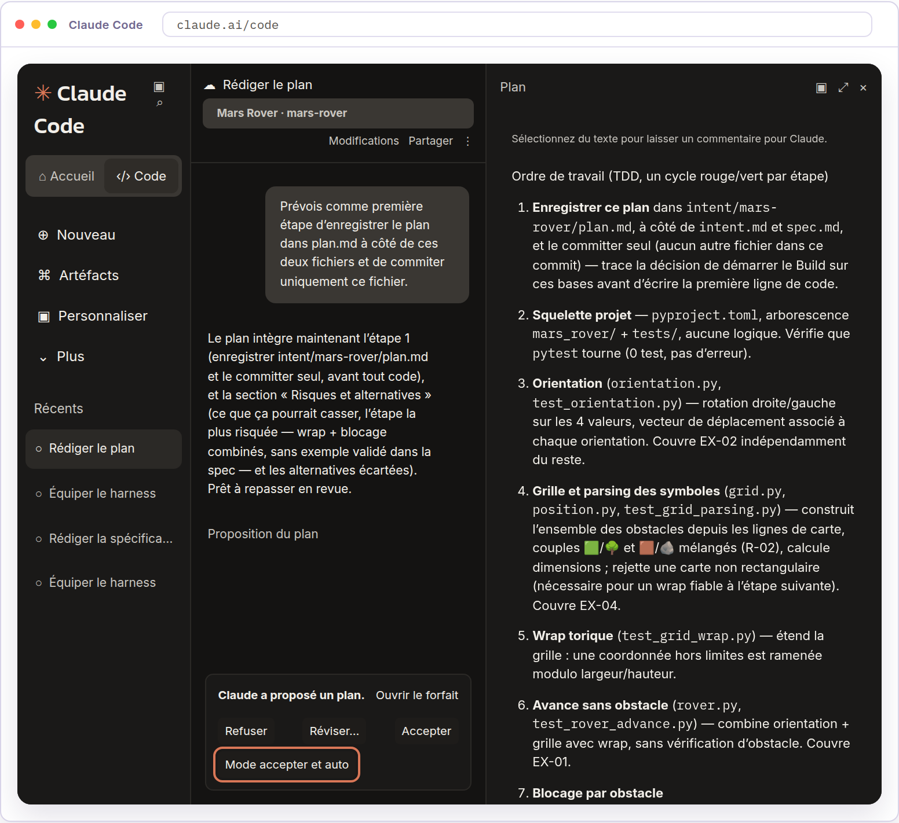

02

### Examinez le résultat.

Lisez le compte rendu de Claude, puis les commandes qu’il a exécutées et leurs sorties. Comparez-les aux exigences de `spec.md`. Repérez les fonctionnalités réalisées, vérifiez que les tests exécutés couvrent les comportements attendus en lisant leurs résultats dans les sorties et pas seulement dans le résumé, et relevez les écarts à `plan.md` ainsi que les choix encore ouverts.

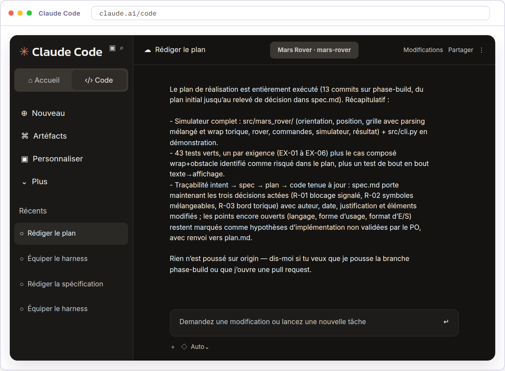

03

### Demandez le push de la branche de build.

Claude propose un push de la branche à la fin de son compte rendu. Une fois votre examen terminé, demandez-lui ce push. La phase Test reprendra ce travail depuis la branche.

`Push la branche courante. N'ouvre pas de pull request.`

Claude indique le push de la branche. Le code, les tests et `plan.md` sont disponibles sur GitHub, sans pull request.

Application en entreprise

Le play *Parallel sessions and subagents* du playbook propose des sessions parallèles pour les tâches qui touchent des fichiers différents. L’Engineer découpe le travail d’après le plan et donne à chaque tâche son worktree et sa branche, par exemple avec `claude --worktree feature-auth`. Les tâches qui touchent les mêmes fichiers sont réalisées l’une après l’autre dans une seule session. Deux ou trois sessions sont un bon point de départ, et le plafond est le nombre de flux qu’une personne peut relire correctement.

Toutes les sessions lisent `CLAUDE.md`, la boucle de vérification de la phase Test réduit leur besoin de supervision, et les permissions sont réglées pour ne pas bloquer les commandes que l’organisation considère sûres. Les définitions de sous-agents sont conservées dans `.claude/agents/` et partagées dans Git, avec des exemples de simplificateur de code, de vérificateur et d’explorateur du repository. Les hooks et permissions du repository encadrent toutes les sessions, et leurs actions sont journalisées et attribuées à l’Engineer qui les pilote. Un hook peut aussi contrôler que `plan.md` reste synchronisé avec le code.

Le mode auto de Claude Code applique ensuite chaque changement sans demander une confirmation à chaque modification. Il devient le défaut pour le travail courant quand les contrôles des plays suivants sont en place, un `CLAUDE.md` ajusté, des skills, des hooks et des tests exécutables, avec une spécification précise et un périmètre limité. L’Engineer relit alors des artefacts après des sessions plus autonomes, au lieu de suivre chaque modification. Avec les worktrees, ce mode ouvre le travail parallèle et prépare la boucle de la phase Maintain.

Le play demande aussi de confier une vérification finale à un sous-agent en contexte neuf, puis de reprendre les écarts retenus avant de considérer le travail terminé. Une équipe fait les deux. Elle demande la correction des écarts, relance les tests sans en modifier aucun, et reporte dans `plan.md` tout écart accepté, parce qu’il change la stratégie. Une correction qui remet le code en conformité avec le plan ne le modifie pas. Le dojo s’arrête à votre examen du résultat.
