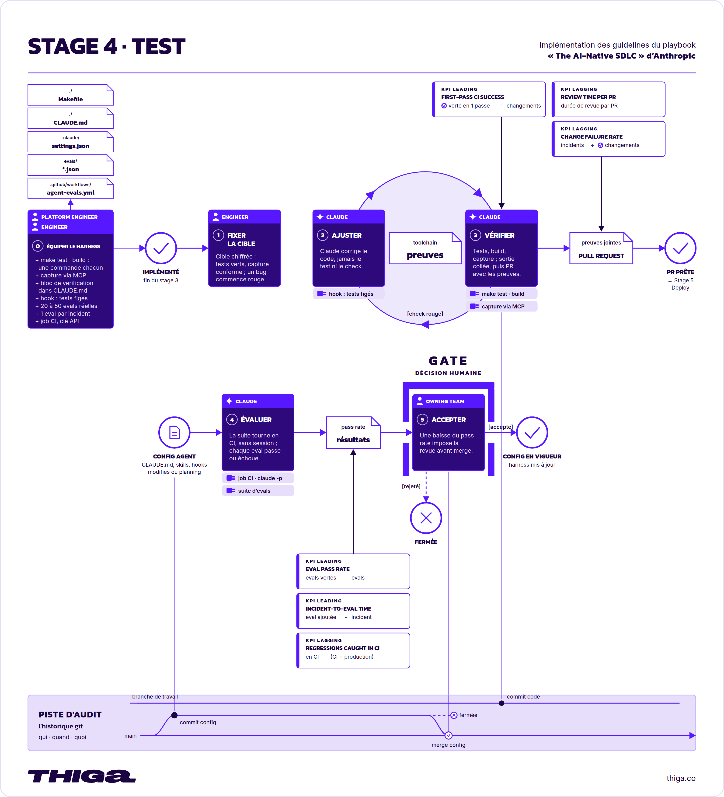
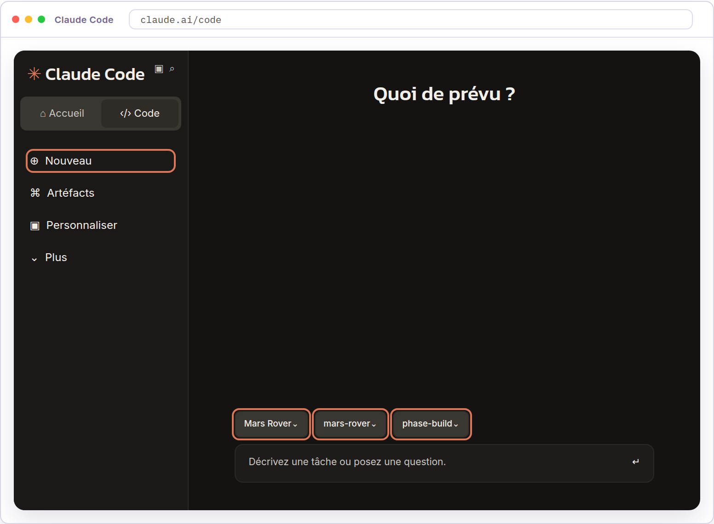
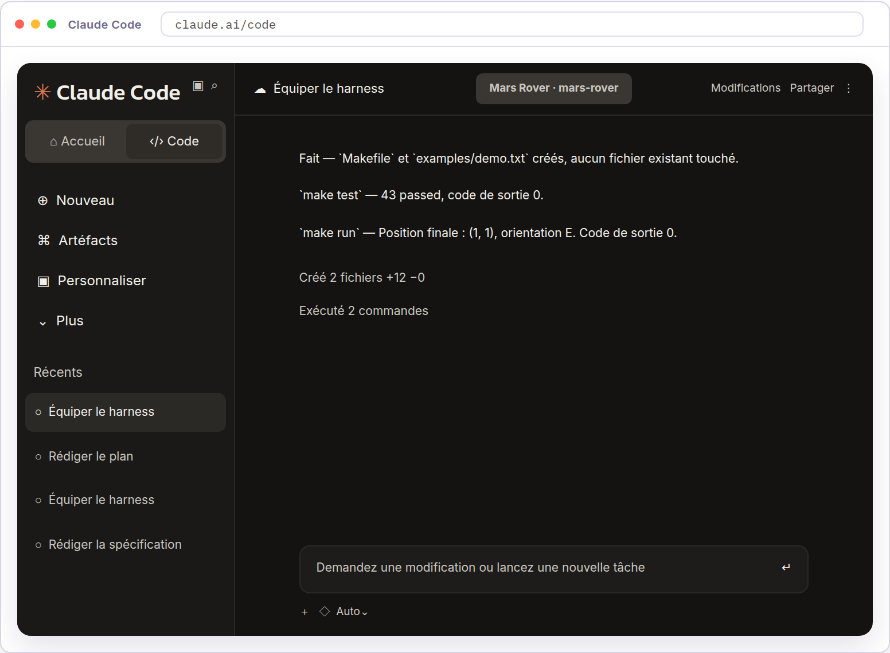
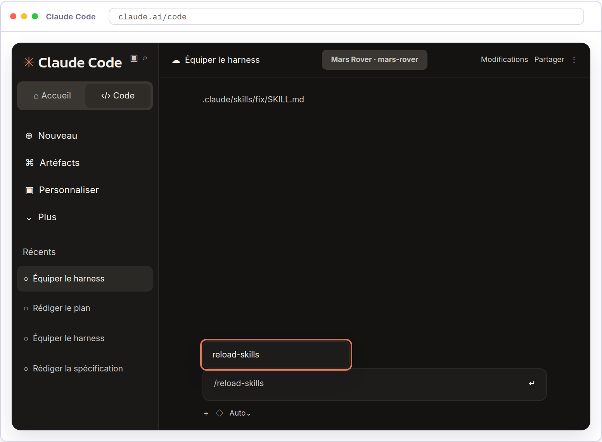
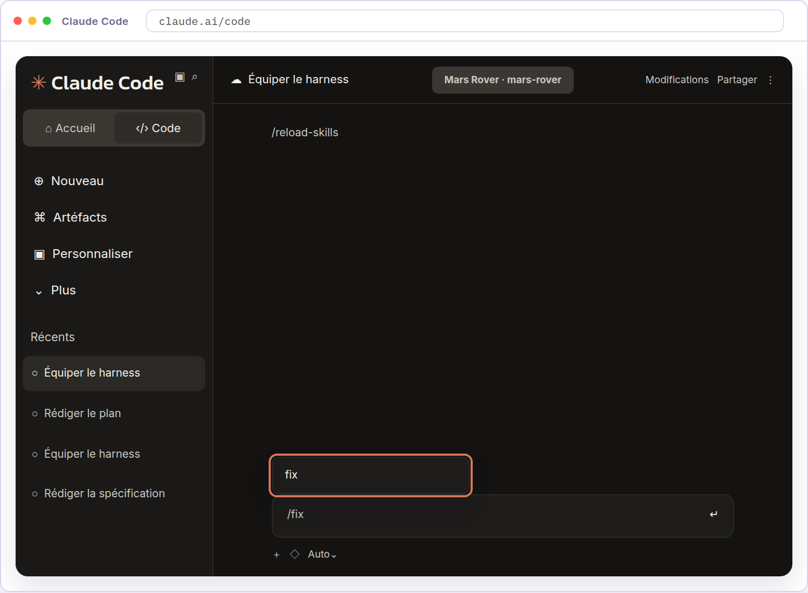

<!-- Converted from thiga-co/dojo-ai-native-sdlc-from-the-tranches (ai-sdlc.html). MIT License, Copyright (c) 2026 Thiga. -->

# Module 4 · Test

## Introduction

Définitions à connaître avant de commencer

**Eval** : évaluation qui rejoue une tâche confiée à l’agent avec des critères d’acceptation. Elle évalue le travail de l’agent, au-delà du seul comportement du programme.

**CI (intégration continue)** : exécution automatique de contrôles sur les changements du projet, par exemple lors d’une proposition de merge.

La phase Build a produit le code du simulateur et ses premiers tests. La phase Test approfondit ces vérifications, puis les protège pendant une correction. Un test modifié pour passer au vert masquerait le bug qu’il devait détecter.

Cette phase s’appuie sur deux plays. *Give Claude a feedback loop* donne à Claude un moyen de vérifier son propre travail avant qu’une personne le voie. *Continuous evals in CI* évalue ensuite le travail de l’agent chaque fois que sa configuration change.

  
*La phase Test en détail*

Le play *Give Claude a feedback loop* du playbook recommande de donner à Claude des commandes qu’il peut lancer lui-même et de quoi juger leur résultat. L’Engineer vérifie les preuves obtenues et décide si le résultat est acceptable.

| Cycle traditionnel | Cycle AI-native |
| --- | --- |
| Le signal indiquant que le code fonctionne arrive tard. L’intégration continue le fournit quelques minutes plus tard, une personne chargée des tests quelques jours plus tard, la production quelques semaines plus tard. Quand un agent produit le code, ce signal tardif oblige une personne à vérifier tout ce qu’il produit. Cette personne devient le point de blocage. | La session dispose d’un moyen de vérifier son propre travail avant qu’une personne ne le voie. Elle exécute les tests, lance la construction du programme ou prend une capture d’écran. Claude procède par itérations jusqu’à la réussite du contrôle. Le travail présenté à l’Engineer a donc déjà passé ce contrôle. La mise en place de cette boucle revient à l’Engineer qui pilote la session. Les étapes du play s’adressent à cette personne. |

## Dans ce module

Vous reprendrez le code du simulateur et ses tests, sur la branche de build. Vous rassemblerez d’abord les vérifications du projet derrière deux commandes, puis vous poserez le hook qui refuse les modifications des fichiers de tests pendant une correction, et vous encoderez la démarche de correction dans une skill. Un prompt dédié créera ensuite un bug volontaire sur les obstacles et retirera les vérifications qui le détectent. Vous lancerez alors cette skill, qui écrira le test reproduisant le bug et l’enregistrera avant de corriger, et vous examinerez le résultat à chacun de ses arrêts.

Vous prendrez le rôle de l’Engineer pour créer les commandes de vérification, celui du Platform Engineer pour créer la protection des tests et la skill, puis reprendrez le rôle de l’Engineer pour créer le bug et le corriger. Le résultat attendu comprend `CLAUDE.md` complété, le hook, la skill `fix`, le test de reproduction et le correctif. Le push du bug suivra sa création, pour que la session qui corrige le découvre sur la branche. Le `Makefile`, `CLAUDE.md`, le hook et la skill rejoindront la branche par le push de leur activité, et le correctif par son acceptation. La pull request sera créée dans la phase Deploy.

## Ce que vous allez faire

1. **Équiper le harness**

   Prendre le rôle de l’Engineer pour créer les commandes de vérification, puis celui du Platform Engineer pour poser le hook qui refuse les modifications des fichiers de tests pendant une correction et encoder la démarche de correction dans la skill `fix`.
2. **Créer un bug**

   Prendre le rôle de l’Engineer et demander à Claude de créer un bug dans le simulateur puis de retirer les vérifications qui le détectent, pour disposer d’un cas à corriger.
3. **Corriger le bug**

   Prendre le rôle de l’Engineer et lancer la skill `fix`, en validant chacun de ses arrêts, du test qui reproduit le bug au correctif qui ne modifie pas ce test, pour apporter une preuve de correction à la fin de la phase Test.

---

## Équiper le harness

Définitions à connaître avant de commencer

**Hook** : script que Claude Code exécute automatiquement lors d’un événement, par exemple avant une modification de fichier, et qui peut refuser l’opération.

**Make** : outil qui exécute des commandes nommées, déclarées dans un fichier `Makefile` à la racine du projet.

**Code de sortie** : nombre renvoyé par une commande lorsqu’elle se termine. La valeur 0 signale une réussite, toute autre valeur un échec.

Le simulateur et ses tests viennent de la phase Build, sur la branche de build. Vous prenez le rôle de l’Engineer pour créer les commandes de vérification, puis celui du Platform Engineer pour créer le hook de protection des tests et la skill qui portera la démarche de correction.

Le play *Give Claude a feedback loop* du playbook demande de rassembler chaque vérification derrière une commande unique, qui signale un échec par un code de sortie non nul. `CLAUDE.md` liste ces commandes avec un exemple de ce qu’elles affichent lorsqu’elles réussissent, et porte la règle qui les rend obligatoires. Avant de déclarer une tâche terminée, Claude lance ces vérifications et présente leurs sorties, sans supprimer ni ignorer un test en échec. Changer un test pour le faire passer masquerait le bug. Le playbook propose de bloquer ces modifications par un hook pendant la correction, ou de refuser en review tout changement qui touche un test.

Le play *Skills as institutional knowledge* du playbook range ailleurs la démarche à suivre pour corriger. `CLAUDE.md` garde les repères permanents du projet, ses commandes et ses conventions, lues à chaque session. Une skill porte une méthode que l’on invoque au moment de s’en servir, comme `clean-code` en phase Build. Une démarche de correction se range de ce côté, puisqu’elle ne sert que lorsqu’un bug est signalé.

Dans ce dojo, un `Makefile` donnera un nom court aux deux vérifications déjà produites par la phase Build, `make test` pour la suite de tests et `make run` pour le scénario de démonstration. `CLAUDE.md` précisera quand les lancer et quelles preuves présenter avant de déclarer la tâche terminée. Un hook refusera les modifications des fichiers de tests pendant une correction. `make fix-start` l’activera, `make fix-end` le refermera. La démarche de correction deviendra la skill `fix`, lancée à la dernière leçon, qui s’arrêtera à chaque point où une décision vous revient. Elle décidera d’abord si le défaut relève du périmètre de la suite de tests, et ne commencera par un test de reproduction que dans ce cas. Un défaut situé hors de ce périmètre, ou qui ne porte sur aucun comportement, se corrige sans test préalable.

Passons à la pratique

## À vous de jouer

Objectif

Prendre le rôle de l’Engineer pour créer les commandes de vérification, puis celui du Platform Engineer pour poser le hook qui refuse les modifications des fichiers de tests pendant une correction et encoder la démarche de correction dans la skill `fix`.

01

### Ouvrez une nouvelle session Claude Code.

Prenez le rôle de l’Engineer pour équiper le harness de vérification. Cliquez sur Nouveau dans la barre latérale. La nouvelle session doit utiliser l’environnement `Mars Rover`, le repository `mars-rover` et la branche de build.



02

### Créez les commandes de vérification.

Demandez à Claude de rassembler les vérifications du projet derrière deux commandes uniques.

`Crée un Makefile à la racine du projet avec deux commandes uniques.``make test exécute toute la suite de tests. Elle renvoie un code de sortie 0``quand tous les tests passent, et un code non nul dès qu'un test échoue.``make run rejoue le scénario de démonstration du simulateur et affiche la``position et l'orientation finales. Crée le fichier d'exemple qu'elle utilise``s'il n'existe pas.``Ne modifie ni les tests, ni leur configuration, ni le code du simulateur.``Exécute les deux commandes et montre leurs sorties et leurs codes de sortie.``Commit ensuite ces fichiers avec le message « Ajoute les commandes de``vérification », puis push la branche courante. N'ouvre pas de pull request.`

Claude doit créer le `Makefile` et le fichier d’exemple, lancer les deux commandes et montrer leurs sorties, avec le code de sortie de chacune. Il indique ensuite le commit créé et le push de la branche.



03

### Complétez `CLAUDE.md`.

Demandez à Claude d’ajouter dans `CLAUDE.md` les deux commandes, ce qu’elles affichent lorsqu’elles réussissent, et la règle qui impose de les lancer avant de déclarer une tâche terminée.

`Ajoute à la fin de CLAUDE.md la section délimitée ci-dessous, sans modifier``le reste du fichier. Remplace chaque [sortie obtenue] par ce que la commande``affiche lorsqu'elle réussit.````` ```md `````## Vérifier ton travail``` - `make test` lance les tests du simulateur. ```[sortie obtenue]``` - `make run` rejoue le scénario de démonstration. ```[sortie obtenue]``Lance ces deux commandes avant de dire qu'une tâche est finie, et donne leur``sortie dans ton compte rendu. Ne corrige jamais un test pour le faire passer,``n'en supprime aucun et n'en ignore aucun.````` ``` `````Commit ensuite CLAUDE.md avec le message « Documente la vérification »,``puis push la branche courante. N'ouvre pas de pull request.`

Claude doit ajouter la section à la fin de `CLAUDE.md`, sans modifier le reste du fichier, et remplacer chaque `[sortie obtenue]` par ce que la commande a affiché. Il indique ensuite le commit créé et le push de la branche.

04

### Créez le hook de protection des tests.

Prenez le rôle du Platform Engineer. Demandez à Claude d’installer le hook qui refuse les modifications des fichiers de tests pendant une correction.

`Crée le fichier .claude/hooks/test_guard.py avec exactement le contenu``ci-dessous.````` ```python `````#!/usr/bin/env python3``import json``import os``import sys``data = json.load(sys.stdin)``file_path = data.get("tool_input", {}).get("file_path", "")``fix_mode = os.path.exists(".claude/fix-mode")``is_test = (` `file_path.startswith("tests/")` `or "/tests/" in file_path` `or os.path.basename(file_path).startswith("test_")``)``if fix_mode and is_test:` `print(` `"Les fichiers de tests sont protégés pendant une correction. "` `"Corrige le code, pas le test.",` `file=sys.stderr,` `)` `sys.exit(2)``sys.exit(0)````` ``` `````Ajoute au Makefile deux cibles, fix-start qui crée le fichier marqueur``.claude/fix-mode, et fix-end qui le supprime.``Crée ensuite .claude/settings.json et branche le hook sous PreToolUse, avec le``matcher Write|Edit. Explique-moi les``opérations couvertes, le rôle du marqueur et le message renvoyé en cas de``refus.``Commit enfin le script, son branchement et les cibles ajoutées au Makefile``avec le message « Ajoute le hook de protection des tests », puis push la``branche courante. N'ouvre pas de pull request.`

Claude indique le fichier de configuration créé, les deux cibles ajoutées et les opérations que le hook couvre. Il précise que le refus ne se produit que lorsque le marqueur est présent, puis indique le commit créé et le push de la branche.

05

### Vérifiez le hook.

Demandez à Claude d’essayer le hook dans les deux régimes, avant et pendant une correction.

`Vérifions le hook en quatre temps.``1. Hors mode correction, tente de modifier un fichier de tests.``2. Lance make fix-start, puis retente la même modification.``3. Toujours en mode correction, tente de modifier un fichier de``src/mars_rover/.``4. Lance make fix-end, puis retente la modification du fichier de tests.``Annule chaque modification qui aboutit, puis montre-moi le résultat des``quatre tentatives.`

Claude doit rapporter quatre résultats, un fichier de tests modifiable avant `make fix-start`, un refus après, le code du simulateur modifiable dans les deux cas, et les tests de nouveau modifiables après `make fix-end`. Il cite le message renvoyé par le hook.

Le quatrième temps referme le mode correction. Le marqueur ne reste donc pas en place après la leçon.

06

### Ajoutez la skill `fix`.

Demandez à Claude d’écrire la démarche de correction dans une skill du repository. Envoyez ce prompt dans la même session.

`Crée le fichier .claude/skills/fix/SKILL.md avec exactement``le contenu ci-dessous. Ne modifie aucun autre fichier.``Commit uniquement ce fichier sur la branche courante avec le message``« Ajoute la skill fix », puis push cette branche. Ne lance pas la skill.``N'ouvre pas de pull request.`````` ````md ``````---``name: fix``description: >-` `Corrige un défaut sous protection des tests, en commençant par le test qui` `le reproduit lorsque le défaut relève du périmètre de la suite. À utiliser` `pour un comportement signalé comme pour un constat de review.``disable-model-invocation: true``---``# Corriger sous protection des tests``## Quand utiliser cette skill``Utilise cette skill dès qu'une correction du code est demandée, qu'elle vienne d'un comportement signalé ou d'un constat de review.``## Par où commencer``` Détermine d'abord si le défaut est un comportement du programme que la suite de tests a vocation à vérifier. La question n'est pas de savoir si elle le couvre aujourd'hui, mais si ce comportement relève de son périmètre, celui que `make test` exécute. ```- Si oui, commence par son test de reproduction, étapes 1 à 4.``- Si non, dis pourquoi et passe à l'étape 5.``Annonce ta conclusion avant d'agir.``## Démarche``` 1. Rejoue le comportement signalé et montre la sortie obtenue. Lance `make test` et montre la sienne. Dis si la suite couvre ce comportement et sur quelle exigence de `spec.md` il repose. ```` 2. Écris le test qui reproduit ce comportement, à sa place dans la suite existante. Lance-le et montre son échec. Dis ce qu'il attend et d'où vient cette attente dans `spec.md`. Ne corrige pas le code. Arrête-toi et demande la confirmation que l'échec vient de la cause attendue. ```3. Commit ce seul test. Ne modifie pas le code.``4. Arrête-toi. Demande l'autorisation de corriger.``` 5. Lance `make fix-start` pour protéger les fichiers de tests. ```` 6. Corrige le code sans modifier les tests. Lance `make test` et `make run`. Montre leurs sorties et le diff de la correction. ```7. Arrête-toi. Demande si la correction est acceptée. Dis que l'acceptation ferme le mode correction, enregistre le changement et pousse la branche.``` 8. Lance `make fix-end` une fois la correction acceptée. ```` 9. Cherche si ce défaut répète une erreur déjà corrigée dans ce projet. Regarde la section des erreurs récurrentes de `CLAUDE.md` et l'historique Git des fichiers que tu viens de modifier. Dis ce que tu as cherché et ce que tu as trouvé. ```10. Si c'est une répétition, propose la règle qui l'évite et attends sa validation avant de l'ajouter dans cette section.``11. Commit la correction acceptée et push la branche courante.``## Règles``- Ne modifie jamais un test pour le faire passer, n'en supprime aucun et n'en ignore aucun.``- N'écris jamais le test après le correctif. Un test rédigé en connaissant la solution ne prouve rien.``- Ne saute aucun arrêt, même si la correction te paraît évidente.``- N'ouvre pas de pull request.`````` ```` `````

Claude indique le fichier créé, le commit et le push. Ouvrez `.claude/skills/fix/SKILL.md` dans le panneau Fichiers. Vérifiez que son contenu reprend le texte du prompt.

La skill rejoint la branche de build, avec le hook et les commandes qu’elle appelle. La session qui corrigera le bug l’y trouvera.

07

### Lancez `/reload-skills`.

Envoyez `/reload-skills` dans la session Claude Code pour recharger les skills du repository.



08

### Recherchez `/fix`.

Saisissez `/fix` dans la zone de message sans l’envoyer. Le menu de commandes doit proposer la skill `fix`.



La suggestion `fix` confirme que Claude Code reconnaît la skill. Un `SKILL.md` mal formé n’apparaîtrait pas ici, et le défaut se découvrirait à la dernière leçon.

Application en entreprise

Le play étend la boucle aux interfaces graphiques avec un outil de navigateur ou de capture d’écran relié à la session. Claude reçoit la maquette, réalise, capture, compare et ajuste, et deux ou trois passages sont courants. Le simulateur n’a pas d’interface graphique.

Le dojo impose la protection des tests par un hook, mais laisse la règle de vérification dans `CLAUDE.md`, où Claude peut la négliger. Une organisation qui veut garantir les deux les impose par des hooks. Les preuves sont les sorties réelles des outils, sortie de tests, journal de construction ou comparaison de captures.

Elles restent dans la session, exportées par OpenTelemetry, un standard de collecte des traces et des mesures, vers la plateforme d’observabilité de l’organisation, et attachées aux contrôles de la PR, où le relecteur et un auditeur peuvent les voir. Le Code Owner approuve la PR en se concentrant sur l’intention et le risque, puisque les preuves mécaniques sont déjà là.

---

## Créer un bug

Les commandes de vérification et le hook sont en place sur la branche de build. Vous prenez le rôle de l’Engineer.

La phase Test demande un bug à corriger. La réalisation de la phase Build étant conforme à la spécification, le dojo en crée un.

Dans ce dojo, le rover avancera sur une case occupée par un obstacle, alors que `spec.md` demande qu’il reste immobile. Les vérifications qui détectent ce comportement seront retirées avec le contrôle, pour que la correction commence par son test comme le play le demande. La suite restera donc verte alors que le simulateur ne respecte plus la spécification, ce qui est la situation que le hook protège ensuite. Ce bug ne vient pas de la phase Build et ne change ni la spécification ni le plan. Une session dédiée le créera puis sera abandonnée. La session qui corrige ne reprendra pas cette conversation. Elle repartira du code et de l’historique de la branche.

Passons à la pratique

## À vous de jouer

Objectif

Prendre le rôle de l’Engineer et demander à Claude de créer un bug dans le simulateur puis de retirer les vérifications qui le détectent, pour disposer d’un cas à corriger.

01

### Ouvrez une nouvelle session Claude Code.

Prenez le rôle de l’Engineer pour créer le bug d’exercice. Cliquez sur Nouveau dans la barre latérale de Claude Code. La nouvelle session doit utiliser l’environnement `Mars Rover`, le repository `mars-rover` et la branche de build.


02

### Créez le bug d’exercice.

Envoyez le message suivant dans cette session.

`Nous préparons un exercice de correction de bug sur le simulateur Mars Rover.``Le code est conforme à la spécification. Nous y introduisons volontairement un``bug pour disposer d'un cas à corriger ensuite. Suis cette séquence sans t'en``écarter.``1. Repère le contrôle d'obstacle et les vérifications existantes qui le``couvrent.``2. Lance make test et make run. Constate qu'ils réussissent et relève la``référence du code initial.``3. Modifie le code nécessaire pour ignorer ce contrôle, sans toucher à spec.md``ni à plan.md.``4. Retire les seules vérifications qui détectent cette avancée incorrecte.``N'en retire aucune autre et ne modifie ni leur configuration ni le reste de la``suite.``5. Relance make test et make run. La suite doit être verte alors que le rover``avance sur l'obstacle. Nomme ce que tu as retiré.``6. Commit cette seule modification sur la branche courante et push-la.``N'ouvre pas de pull request. Ne corrige rien.`

Claude doit suivre les six étapes dans l’ordre et rendre compte de chacune. Il indique le comportement relevé avant la modification, ce qu’il a retiré, la suite devenue verte et le push du commit.

---

## Corriger le bug

Définition à connaître avant de commencer

**Diff** : présentation des différences entre deux versions des fichiers, qui permet de relire les changements proposés.

Le bug d’exercice, les commandes de vérification, le hook et la skill `fix` sont sur la branche de build après un push. Un utilisateur signale que le rover avance sur une case occupée par un obstacle. Vous reprenez le rôle de l’Engineer dans une session neuve, qui découvrira ce harness dans le repository.

Le play *Give Claude a feedback loop* du playbook fait commencer une correction par son test. Il demande de reproduire le bug par un test, de constater son échec pour la raison attendue, puis un commit de ce test avant toute correction. Le correctif vient ensuite, sans toucher au test, et les contrôles sont relancés. Un test écrit après le correctif ne prouverait rien, puisqu’il serait rédigé en connaissant la solution. L’Engineer examine les sorties et le diff avant d’accepter le résultat.

Dans ce dojo, la suite ne détecte plus le comportement signalé, ses vérifications ayant été retirées avec le contrôle. Le comportement signalé relève du périmètre de la suite, la skill `fix` conduira donc la correction dans cet ordre et s’arrêtera trois fois pour vous laisser juger, après l’échec du test, après son enregistrement et devant le diff. Le mode correction protégera ce test pendant que Claude modifie le code, et son passage de l’échec à la réussite apportera la preuve de correction. Les autres tests permettront de détecter une régression ailleurs dans le programme.

Ces arrêts tiennent à ce que la skill demande. Elle guide Claude sans garantir qu’il s’y tienne, contrairement au hook qui refuse les modifications de tests quoi qu’elle fasse. L’ordre des commits, lui, se vérifie dans l’historique.

Passons à la pratique

## À vous de jouer

Objectif

Prendre le rôle de l’Engineer et lancer la skill `fix`, en validant chacun de ses arrêts, du test qui reproduit le bug au correctif qui ne modifie pas ce test, pour apporter une preuve de correction à la fin de la phase Test.

01

### Ouvrez une nouvelle session Claude Code.

Prenez le rôle de l’Engineer pour corriger le bug. Cliquez sur Nouveau dans la barre latérale. La nouvelle session doit utiliser l’environnement `Mars Rover`, le repository `mars-rover` et la branche de build.


02

### Lancez `/fix`.

Donnez à la skill le signalement reçu.

`/fix Un utilisateur signale que le rover avance sur une case occupée par``un obstacle, alors que spec.md demande qu'il reste immobile.`

Claude doit montrer le rover franchissant l’obstacle, puis une suite verte. Il rattache le comportement attendu à l’exigence de `spec.md`, écrit le test qui le reproduit et montre son échec. Il s’arrête ensuite et vous demande de confirmer.

Vérifiez que le test échoue pour la raison que vous attendez, et non pour une erreur d’écriture. Un test qui échoue pour une autre cause ne prouverait pas la correction. Confirmez ensuite dans la conversation, pour que Claude enregistre ce test seul.

Claude indique le commit créé et le fichier concerné, puis s’arrête avant de corriger. Le test existe désormais dans l’historique, et le diff de la correction montrera qu’il n’a pas été réécrit.

03

### Validez la correction.

Autorisez la correction dans la conversation. Claude ferme les tests aux modifications, corrige le code et relance les deux commandes.

Claude doit montrer les sorties de `make test` et de `make run`, puis le diff de la correction. Il vous demande ensuite si vous l’acceptez.

Vérifiez que le test enregistré passe sans que son attente ait changé, que le rover reste immobile devant l’obstacle, et que le correctif ne touche que le code du bug.

Si Claude a enchaîné sans s’arrêter, l’historique reste la preuve. Demandez-lui les deux derniers commits et vérifiez que celui du test précède celui du correctif. Refusez le résultat dans le cas contraire, et reprenez depuis le test.

Acceptez ensuite la correction dans la conversation. L’acceptation ferme le mode correction, enregistre le changement et pousse la branche. Claude indique que le marqueur a été supprimé, cherche si ce défaut répète une erreur déjà corrigée, puis indique le commit et le push.

Vérifiez la sortie du marqueur. Un marqueur laissé en place bloquerait toute modification de test après la leçon. Vérifiez aussi ce que Claude a cherché pour établir la répétition, la section des erreurs récurrentes de `CLAUDE.md` et l’historique des fichiers modifiés. Dans ce parcours, la réponse attendue est une première occurrence.

Application en entreprise

Le play *Continuous evals in CI* du playbook fait des evals l’équivalent AI-native des points de contrôle qualité. La suite s’exécute à chaque changement de la configuration de l’agent, nouveau modèle, prompt réécrit, modification de `CLAUDE.md`, d’une skill ou d’un hook, car cette configuration pilote l’agent et mérite les tests de régression accordés au code.

Le play demande au Platform Engineer de rassembler 20 à 50 tâches réelles issues du travail récent, chacune avec son résultat attendu ou accepté. Chaque eval associe un prompt aux contrôles qui définissent la réussite, tests réussis, contrôle de code sans erreur, comportement préservé, règle respectée. La suite reste vivante, des cas deviennent trop faciles quand les modèles progressent et de nouveaux cas viennent du suivi réel. Chaque incident de production devient une eval permanente, écrite par l’équipe concernée. Selon le besoin, une équipe peut lancer la suite hors ligne à intervalles réguliers plutôt qu’à chaque changement.

Cette organisation demande une CI capable d’exécuter Claude sans intervention, un accès à l’API de Claude et un budget d’exécution. Un seuil de réussite contrôle le merge des changements de configuration, une baisse est examinée par l’équipe responsable avant acceptation, et les exécutions sont journalisées pour comparer les résultats. Le dojo explique les evals sans créer de suite ni d’installation CI. Dans Mars Rover, corriger l’obstacle sans modifier le test qui le détecte illustre un critère d’eval.
