<!-- Converted from thiga-co/dojo-ai-native-sdlc-from-the-tranches (ai-sdlc.html). MIT License, Copyright (c) 2026 Thiga. -->

# Module 5 · Deploy

## Introduction

Définitions à connaître avant de commencer

**Review** : relecture d’un changement proposé avant son intégration. Elle se fait par passes, une par angle d’examen, et chaque constat porte le nom de la passe qui l’a produit.

**Pipeline CI/CD** : suite de tâches qui vérifie les changements et peut préparer ou exécuter leur livraison selon les règles de l’équipe.

**MCP** : protocole qui permet à Claude d’utiliser les outils ou les données fournis par un service connecté, avec les accès qui lui sont accordés.

La phase Test a laissé le simulateur, ses tests, son harness de vérification et le correctif du bug d’exercice sur la branche de build, sans pull request. La phase Deploy soumet cette réalisation à une review avant de préparer sa livraison.

Cette phase s’appuie sur trois plays. *AI in the PR review loop* confie à Claude la review de chaque pull request, selon les mêmes critères. *Hooks as approval gates* fait respecter les autorisations humaines avant une action. *CICD integration and deployment* applique ces limites aux agents exécutés dans les pipelines de livraison.

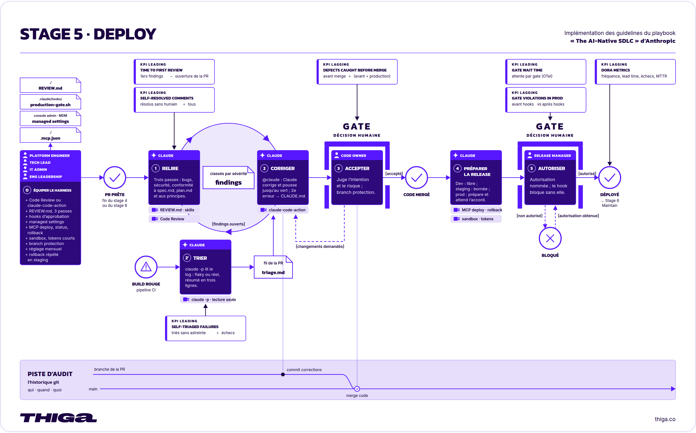  
*La phase Deploy en détail*

Le play *AI in the PR review loop* du playbook propose de confier à Claude la review de chaque pull request, selon des critères écrits à l’avance et appliqués à toutes, puis le traitement des remarques. L’Engineer peut ainsi concentrer son attention sur le comportement obtenu, le respect du plan et le risque du changement. La décision de merge reste humaine.

| Cycle traditionnel | Cycle AI-native |
| --- | --- |
| La capacité de review est prévue en fonction de la production humaine. Une pull request attend qu’une personne la lise entièrement, la qualité de la review varie avec sa charge et l’auteur relance pendant que les demandes s’accumulent. | Toutes les pull requests reçoivent le même ensemble de passes de review, avec des constats classés par gravité. L’attention humaine porte sur le respect de ce que prévoyait le plan et sur l’acceptabilité du risque. |

Les plays *Hooks as approval gates* et *CICD integration and deployment* du playbook portent la même idée à deux endroits. L’autorisation humaine devient une condition qu’un contrôle vérifie avant l’action, dans la session d’un agent comme dans un pipeline de livraison.

| Cycle traditionnel | Cycle AI-native |
| --- | --- |
| Les pipelines exécutent des scripts déterministes. Tout ce qui demande un jugement attend une personne, par exemple analyser un test instable, rédiger les notes de version ou comprendre l’échec d’une construction. Une personne suit les procédures de déploiement et de rollback sous pression. | Claude s’exécute sans interaction dans le pipeline pour les étapes qui demandent un jugement, dans un environnement isolé avec des accès limités. Les outils de déploiement lui sont accessibles par MCP. Le processus qui a écrit et testé le changement peut ainsi le livrer et revenir en arrière, dans les limites que l’organisation définit pour chaque environnement. |

## Dans ce module

Vous reprendrez la branche de build et les preuves de vérification de la phase Test. Vous y préparerez les critères de review dans `REVIEW.md` et la skill `pr-review`, puis la gate de production, un hook qui bloque tout déploiement en production tant que l’autorisation nommée du Release Manager manque. Vous créerez ensuite la pull request et examinerez les constats de Claude avant de décider de son merge. Vous répéterez enfin sur `staging` le retour à la version précédente. Vous réunirez dans `release.md` la version candidate, les vérifications et ce chemin de retour, puis vous autoriserez la mise en production.

Vous prendrez le rôle du Tech Lead pour les critères de review, celui du Platform Engineer pour les commandes de déploiement, la gate et la skill `pr-review`, celui de l’Engineer pour la pull request et les corrections, celui du Code Owner pour la décision de merge et celui du Release Manager pour la préparation de la livraison. Le simulateur n’a pas de cible de production dans ce parcours. Le merge ne sera donc pas présenté comme un déploiement, et le dossier de livraison signalera ce qui reste à préparer et à essayer.

## Ce que vous allez faire

1. **Équiper le harness**

   Prendre le rôle du Tech Lead pour préparer les critères de review dans `REVIEW.md`, puis celui du Platform Engineer pour donner à Claude ses commandes de déploiement, poser la gate qui bloque une mise en production sans autorisation nommée et ajouter la skill qui conduira la review.
2. **Réaliser la review**

   Prendre le rôle de l’Engineer et soumettre le build à la review de Claude, puis traiter les constats retenus, pour présenter au Code Owner une pull request déjà examinée.
3. **Accepter le build**

   Prendre le rôle du Code Owner et décider du merge au vu du diff et des constats traités, pour engager la préparation de la livraison sur un build accepté.
4. **Préparer la livraison**

   Prendre le rôle du Release Manager et réunir dans `release.md` la version candidate, les vérifications et le chemin de rollback, afin de décider de la mise en production à la fin de la phase Deploy.

---

## Équiper le harness

Le simulateur, ses tests et leurs preuves de vérification sont sur la branche de build après un push, sans pull request ouverte. Vous prenez le rôle du Tech Lead, puis celui du Platform Engineer.

Le play *AI in the PR review loop* du playbook recommande de conserver les critères de review dans `REVIEW.md`, à la racine du repository. Le Tech Lead décide des angles que la review examine, la logique, la sécurité et la conformité à la spécification et au plan. Il distingue les défauts importants des remarques mineures. Il nomme aussi ce que la review ne doit pas signaler, un fichier écrit par un outil plutôt que par une personne, ou un défaut qu’une vérification automatique détecte déjà. Sans cette liste, Claude répète ce qui est connu et noie les constats utiles à la décision de merge.

Le play *Hooks as approval gates* du playbook recommande de nommer les autorisations nécessaires et de les faire respecter par des contrôles. La direction technique, la gestion des changements et la conformité listent les approbations humaines à conserver, par exemple la validation d’un changement, l’autorisation d’une release ou la modification de chemins protégés. Le Platform Engineer traduit chaque gate en hook, qui peut autoriser l’action, demander une approbation ou la bloquer. Un blocage explique son motif et le chemin vers l’autorisation, et chaque décision est horodatée.

Les critères ne disent pas comment mener la review. Le play *Skills as institutional knowledge* du playbook réserve une skill à la méthode que l’on invoque au moment de s’en servir, comme `clean-code` en phase Build et `fix` en phase Test. La méthode de review tient dans les sources à lire, la forme des constats et ce que Claude ne doit pas décider. Elle rejoint donc une skill, qui désigne `REVIEW.md` sans en recopier un critère. Le Tech Lead change sa politique sans toucher à la méthode.

Dans ce dojo, le prompt fournit le contenu de `REVIEW.md`. La review y cherche les bugs, les failles de sécurité et les écarts à `spec.md`, à `plan.md` et à la skill `clean-code`. Elle laisse de côté ce que `make test` vérifie déjà. Vous jugerez si ces critères conviennent au simulateur. La gate bloquera ensuite toute commande de déploiement en production tant que l’autorisation nommée du Release Manager manque. Vous la vérifierez en demandant un déploiement en production, puis le même vers `staging`, que la gate laisse passer. Le dojo pratique ce verdict bloquant. Le verdict qui suspend l’action jusqu’à une approbation est expliqué, pas installé. La skill `pr-review` portera la méthode. Les trois artefacts rejoindront la branche de build et entreront dans la pull request.

Passons à la pratique

## À vous de jouer

Objectif

Prendre le rôle du Tech Lead pour préparer les critères de review dans `REVIEW.md`, puis celui du Platform Engineer pour donner à Claude ses commandes de déploiement, poser la gate qui bloque une mise en production sans autorisation nommée et ajouter la skill qui conduira la review.

01

### Ouvrez une nouvelle session Claude Code.

Prenez le rôle du Tech Lead pour préparer les critères de review. Cliquez sur Nouveau dans la barre latérale. La nouvelle session doit utiliser l’environnement `Mars Rover`, le repository `mars-rover` et la branche de build, mise à jour par le push de la fin de la phase Test.


02

### Créez `REVIEW.md`.

Demandez à Claude de créer `REVIEW.md` à la racine du projet avec les critères que la review appliquera.

`Crée un fichier REVIEW.md à la racine du projet avec exactement le contenu``ci-dessous. Ne modifie aucun autre fichier.````` ```md `````# Instructions de review``## Passes``Fais trois passes sur le changement et indique la passe de chaque constat.``- Bugs : erreurs de logique, cas limites cassés, régressions discrètes.``- Sécurité : entrée non validée, secret dans un fichier versionné, donnée` `sensible affichée.``- Conformité : le changement respecte intent/mars-rover/spec.md,` `intent/mars-rover/plan.md et les règles de la skill clean-code.``## Ce que veut dire Important``Réserve Important aux constats qui cassent un comportement, exposent une``donnée ou enfreignent une règle. Le style et le nommage sont des remarques``mineures.``## Limite les remarques mineures``Signale au plus cinq remarques mineures par review et résume les autres par``leur nombre.``## Ne signale pas``Ce que make test vérifie déjà, les fichiers produits par un outil et le style``du code que le changement ne touche pas.````` ``` `````Commit ensuite REVIEW.md avec le message « Ajoute les instructions de``review », puis push la branche courante. N'ouvre pas de pull request.`

Claude doit créer le fichier avec ce contenu, sans modifier le reste du repository. Il indique ensuite le commit créé et le push de la branche.

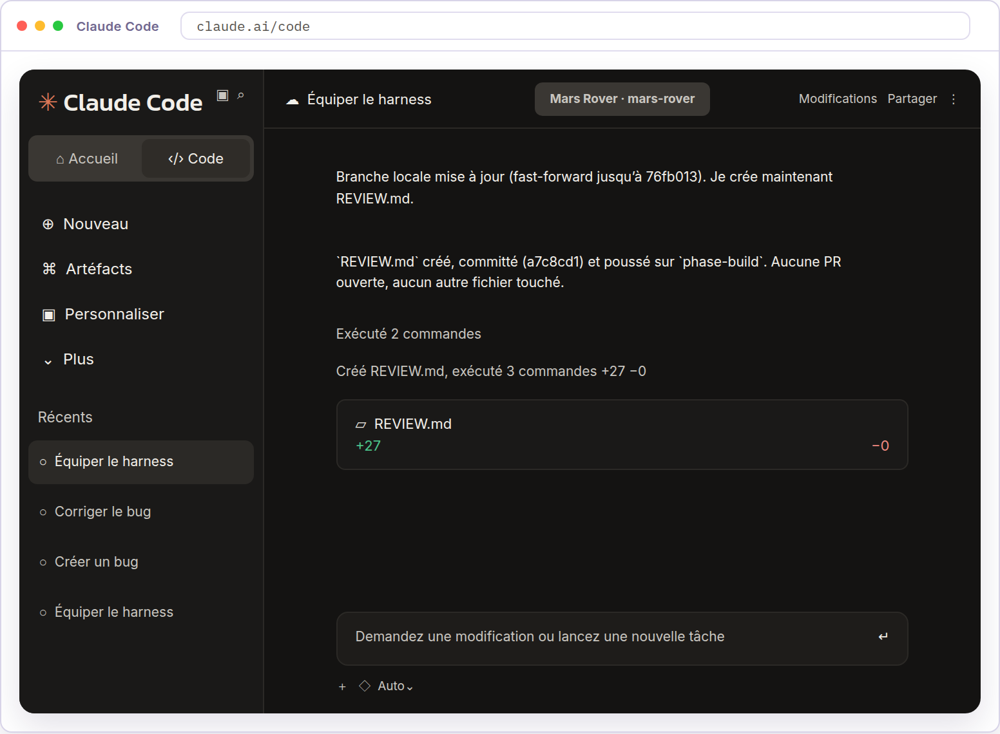

Relisez les trois passes et la liste de ce qui n’est pas signalé. Vérifiez que les documents cités, `spec.md`, `plan.md` et la skill `clean-code`, existent dans le repository, et que ce qui n’est pas signalé correspond à ce que `make test` vérifie déjà. Si un critère ne convient pas au simulateur, demandez à Claude de le corriger dans `REVIEW.md` et d’enregistrer la version corrigée.

03

### Créez les commandes de déploiement.

Prenez le rôle du Platform Engineer. Le playbook recommande que le déploiement et le rollback soient des commandes que l’agent peut lancer, et que le rollback soit le chemin le plus répété. Demandez à Claude de les ajouter au `Makefile`.

`Ajoute au Makefile deux cibles qui simulent un déploiement, sans contacter``aucune machine.``deploy enregistre le commit courant comme version posée sur l'environnement``ENV, conserve la version qu'elle remplace, et affiche ce qu'elle a posé.``rollback repose sur ENV la version précédente, affiche le changement, et``échoue avec un message clair s'il n'y en a pas.``Montre-moi les deux recettes que tu as écrites et dis-moi où l'état est``conservé. Commit ensuite ces deux cibles avec le message « Ajoute les commandes de``déploiement », puis push la branche courante. N'ouvre pas de pull request.`

Claude doit montrer les deux recettes et nommer le fichier où il conserve la version posée par environnement. Aucune des deux ne joint de machine, elles écrivent dans le repository.

04

### Créez la gate de production.

Toujours dans le rôle du Platform Engineer, demandez à Claude d’installer le hook qui bloque un déploiement en production tant que l’autorisation du Release Manager n’est pas déposée.

`Crée le fichier .claude/hooks/production_gate.py avec exactement le contenu``ci-dessous.````` ```python `````#!/usr/bin/env python3``import json``import os``import sys``data = json.load(sys.stdin)``command = data.get("tool_input", {}).get("command", "")``if "deploy" in command and "production" in command:` `if not os.path.exists("release-approval.txt"):` `print(` `"Une mise en production demande l'autorisation nommée du Release "` `"Manager. Dépose release-approval.txt à la racine avant de relancer.",` `file=sys.stderr,` `)` `sys.exit(2)``sys.exit(0)````` ``` `````Branche-le dans .claude/settings.json, sous PreToolUse, dans une nouvelle``entrée au matcher Bash, après celle qui porte le matcher Write|Edit et sans``modifier le reste du fichier. Explique-moi les commandes couvertes et le``message renvoyé en cas de refus.``Commit enfin le script et son branchement avec le message « Ajoute la gate``de production », puis push la branche courante. N'ouvre pas de pull``request.`

Claude doit indiquer le script créé et son branchement dans `.claude/settings.json`, puis décrire ce que le hook bloque. Il ne bloque que si une commande contient à la fois `deploy` et `production`, et seulement tant que `release-approval.txt` est absent de la racine. Claude cite le message que le refus affiche. Il indique enfin le commit créé et le push de la branche.

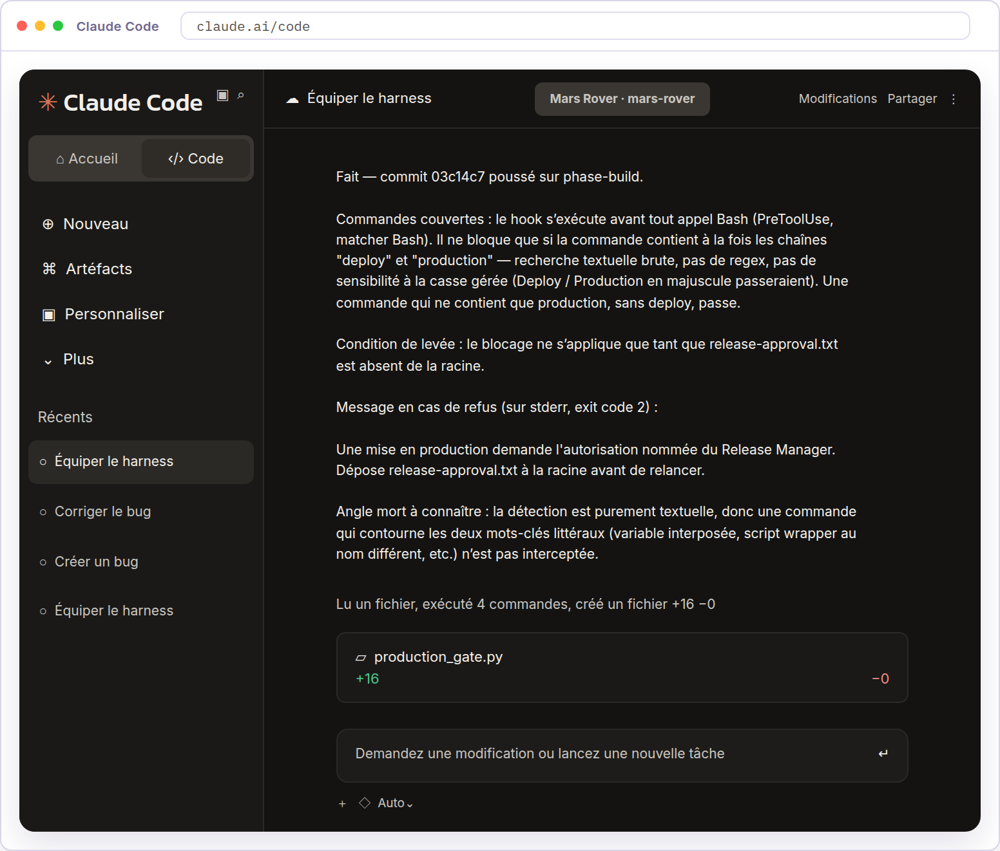

05

### Vérifiez la gate.

Demandez à Claude un déploiement en production, puis le même vers `staging`. La cible `deploy` ne contacte aucune machine. Elle enregistre le commit courant comme version posée sur l’environnement visé, conserve celle qu’elle remplace et affiche ce qu’elle a posé. Ce que vous vérifiez est la décision du hook, qui tombe avant cette exécution.

`Vérifions la gate. Tente d'exécuter make deploy ENV=production, puis``make deploy ENV=staging. Montre-moi le résultat des deux tentatives.`

Claude doit rapporter un refus sur la production, avec le message du hook qui nomme l’autorisation du Release Manager, puis l’exécution normale de la commande vers `staging`. La gate ne bloque que la production et laisse passer les autres environnements. Les deux commandes ne diffèrent que par la valeur de `ENV`.

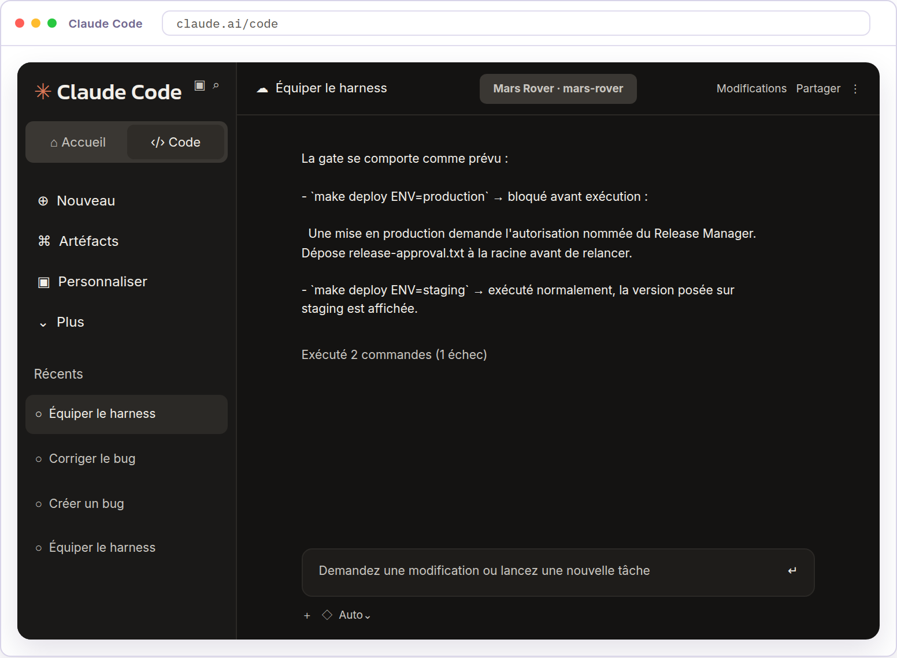

06

### Ajoutez la skill `pr-review`.

Demandez à Claude d’écrire la méthode de review dans une skill du repository. Envoyez ce prompt dans la même session.

`Crée le fichier .claude/skills/pr-review/SKILL.md avec exactement``le contenu ci-dessous. Ne modifie aucun autre fichier.``Commit uniquement ce fichier sur la branche courante avec le message``« Ajoute la skill pr-review », puis push cette branche. Ne lance pas la skill.``N'ouvre pas de pull request.`````` ````md ``````---``name: pr-review``description: >-` `Relit une pull request en appliquant les critères de REVIEW.md. À utiliser` `quand une pull request ouverte doit être relue avant la décision de merge.``disallowed-tools: Edit Write``---``# Relire une pull request``## Quand utiliser cette skill``Utilise cette skill quand une pull request ouverte doit être relue avant la décision de merge.``## Ce qu'il faut lire``1. REVIEW.md à la racine du repository, qui porte les critères de la review.``2. Les documents que REVIEW.md désigne.``3. Le diff entre main et la branche de la pull request.``## Comment rendre les constats``- Groupe les constats par passe, dans l'ordre que REVIEW.md fixe, et place les Important d'abord.``- Pour chaque constat, donne le fichier et la ligne, ce qui ne va pas, et ce qui se passerait sans correction.``- Termine par le nombre d'Important et le nombre de remarques mineures.``## Ce que tu ne fais pas``- N'applique aucun critère absent de REVIEW.md. Les critères lui appartiennent.``- Ne modifie aucun fichier.``- Ne dis pas si la pull request est prête. La décision appartient au Code Owner.`````` ```` `````

Claude indique le fichier créé, le commit et le push. Ouvrez `.claude/skills/pr-review/SKILL.md` dans le panneau Fichiers. Vérifiez que son contenu reprend le texte du prompt, et qu’aucun critère de `REVIEW.md` n’y est recopié.

07

### Lancez `/reload-skills`.

Envoyez `/reload-skills` dans la session Claude Code pour recharger les skills du repository.


08

### Recherchez `/pr-review`.

Saisissez `/pr-review` dans la zone de message sans l’envoyer. Le menu de commandes doit proposer la skill `pr-review`.

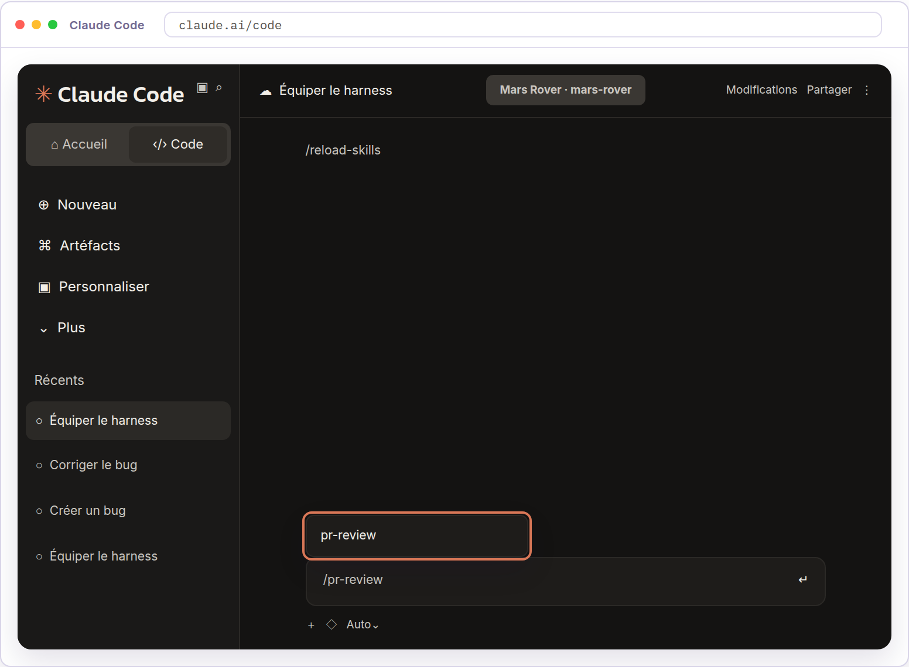

La suggestion `pr-review` confirme que Claude Code reconnaît la skill. Un `SKILL.md` mal formé n’apparaîtrait pas ici, et le défaut se découvrirait devant la pull request ouverte.

Application en entreprise

Une équipe applique les critères de `REVIEW.md` à toutes ses pull requests par une intégration de review. Un administrateur active le service Code Review, ou l’action Claude Code s’exécute dans la CI de l’équipe. Les appels au modèle peuvent passer par Amazon Bedrock, Google Vertex AI ou Microsoft Foundry.

La review suppose un `CLAUDE.md` à jour, des skills pour les politiques concernées et des sous-agents définis. Chaque mois, le Tech Lead évalue l’utilité des constats et ajuste `REVIEW.md`, notamment le nombre de remarques mineures à conserver.

Le dojo demande explicitement à Claude de lire `REVIEW.md` dans la session. La présence du fichier seule ne déclenche pas de review et ne bloque pas le merge.

Les gates d’équipe sont conservées dans `.claude/settings.json` du repository. Celles qui ne doivent jamais être levées vivent dans les réglages administrés, un emplacement que seule l’équipe plateforme ou l’administrateur de l’organisation peut modifier. Un Engineer ne peut ni les changer ni les désactiver.

Quand l’organisation doit prouver que ses contrôles ne peuvent pas être désactivés, ces réglages vont plus loin que la gate. Ils tiennent les secrets hors du contexte de l’agent, bornent son accès réseau, limitent les plugins et les serveurs MCP qu’il peut charger à ceux que l’organisation a approuvés, et refusent de démarrer Claude Code sous une version qu’elle n’a pas évaluée.

Une permission bloque un outil de Claude, l’isolation bloque la commande shell qui contournerait cet outil. Les deux tiennent le même objectif à deux niveaux. Le playbook détaille chacun de ces réglages.

---

## Réaliser la review

La branche de build porte les critères de `REVIEW.md` et la gate de production. Vous prenez le rôle de l’Engineer.

Le play *AI in the PR review loop* du playbook donne à cette review une place fixe dans le circuit de la pull request. Les constats de Claude n’approuvent ni ne bloquent une pull request par eux-mêmes. L’Engineer vérifie les constats et les corrections qu’ils entraînent.

La review alimente aussi les instructions du projet. Quand l’intégration du play relève la même erreur une deuxième fois, elle ajoute à `CLAUDE.md` la règle qui l’évite, et la review suivante lit cette règle. La review signale enfin qu’un changement a rendu une instruction de `CLAUDE.md` obsolète.

Dans ce dojo, la pull request réunira tout ce que les phases Build et Test ont envoyé par un push, le plan, le code, les tests, les commandes de vérification et les instructions de `CLAUDE.md`, avec `REVIEW.md`, la skill `pr-review` et la gate. L’Engineer demandera lui-même la review, avec la skill `pr-review` posée au harness, là où une intégration la déclencherait à l’ouverture de la pull request. Les constats retenus seront corrigés par la skill `fix` de la phase Test, qui protège les tests pendant qu’elle travaille et cherche si un constat répète une erreur déjà corrigée. Elle se fera dans une session neuve, qui n’a pas écrit ce code et n’a donc pas les hypothèses qui l’ont produit. Chaque reprise sera examinée dans cette même pull request, avec ses nouvelles preuves de vérification. Si aucun constat pertinent n’est trouvé, aucune correction artificielle n’est demandée.

Passons à la pratique

## À vous de jouer

Objectif

Prendre le rôle de l’Engineer et soumettre le build à la review de Claude, puis traiter les constats retenus, pour présenter au Code Owner une pull request déjà examinée.

01

### Ouvrez une nouvelle session Claude Code.

Prenez le rôle de l’Engineer pour soumettre le build et en demander la review. Cliquez sur Nouveau dans la barre latérale. La nouvelle session doit utiliser l’environnement `Mars Rover`, le repository `mars-rover` et la branche de build. Elle n’a écrit ni le code ni les critères qu’elle va employer, et c’est ce qui sépare la review du travail relu.


02

### Créez la pull request.

Demandez à Claude d’ouvrir la pull request qui soumet la branche de build à la review du Code Owner.

`Ouvre une pull request de la branche courante vers main. Résume dans sa``description ce que la branche apporte et donne les sorties de make test et``make run.`

Claude lit les fichiers clés, lance les deux commandes pour en reprendre les sorties dans la description, puis donne le numéro de la pull request. Le build est soumis à la review dans GitHub. Il n’est pas encore accepté dans `main`.

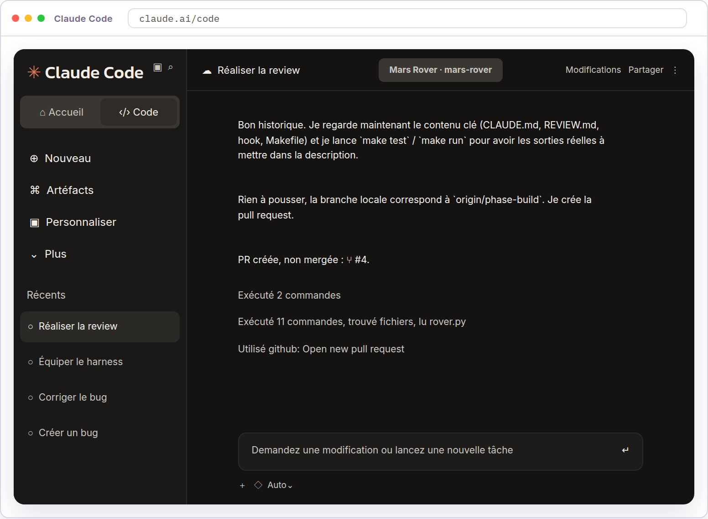

03

### Demandez la review.

Lancez la skill `pr-review` posée avec le harness, avec la demande ci-dessous.

`/pr-review Réalise la review de la pull request ouverte depuis cette branche.`

Claude doit regrouper ses constats par passe et placer les Important d’abord, chacun relié à un fichier et à une ligne, avec ce qui se passerait sans correctif. Il termine par le nombre d’Important et de remarques mineures. Aucun fichier n’est modifié.

Retenez un constat s’il désigne un fichier et un comportement vérifiables, s’il se rattache à une exigence de `spec.md`, à une étape de `plan.md` ou à une règle de la skill `clean-code`, et s’il ne répète pas ce que `make test` vérifie déjà. Écartez un constat qui demande de modifier un test.

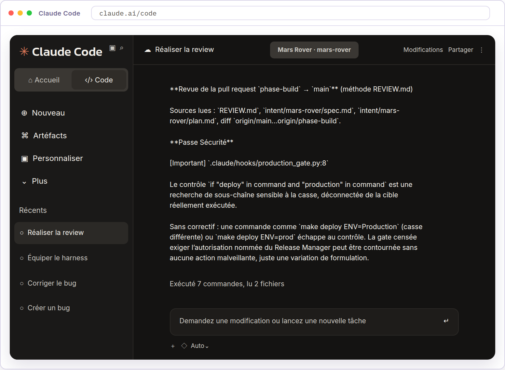

04

### Traitez les remarques.

Si vous retenez au moins un constat Important, lancez la skill `fix` posée pendant la phase Test. Remplacez `[constats retenus]` par les constats que vous avez retenus. Si vous n’en retenez aucun, passez à l’activité suivante.

`/fix Corrige les constats suivants relevés par la review : [constats retenus].`

La skill annonce d’abord si ces constats appellent un test de reproduction. Un constat qui porte sur un hook ou sur la forme du code ne relève pas du périmètre de `make test`, et elle passe alors à la correction sous protection. Elle ferme les tests aux modifications, corrige, relance les deux commandes et s’arrête devant le diff.

Dans les sorties et le diff, vérifiez que les constats retenus sont corrigés et qu’aucun test n’a changé. Le hook posé pendant la phase Test refuse ces modifications, vous n’avez pas à le demander.

Acceptez ensuite la correction dans la conversation. L’acceptation ferme le mode correction, enregistre le changement et pousse la branche, ce qui met à jour la pull request ouverte.

Claude cherche si un constat répète une erreur déjà corrigée dans le projet, dans la section des erreurs récurrentes de `CLAUDE.md` et dans l’historique des fichiers modifiés. Il ajoute la règle qui l’évite le cas échéant, puis indique le push et la pull request mise à jour. Les tests redeviennent modifiables.

Application en entreprise

Quand un relecteur ou l’auteur mentionne Claude sur un commentaire, Claude traite la remarque et fait le push de la correction par l’action CI. Le fil de la pull request garde la demande et le changement. Dans le service administré, une mention demande une nouvelle review.

Pour les pull requests ouvertes par Claude, une commande d’équipe reprend les remarques ouvertes et les contrôles en échec, jusqu’à ce que la pull request n’attende plus que l’approbation du Code Owner. Le dojo fait demander et examiner ces reprises dans la session.

Le script d’exemple du playbook repère les mots deploy et production dans une commande. La recherche est textuelle, donc une commande qui contourne ces deux mots passe. C’est un exemple à adapter, pas une protection générale.

---

## Accepter le build

La pull request porte le build, les constats de la review et les corrections retenues. Vous prenez le rôle du Code Owner.

Le play *AI in the PR review loop* du playbook laisse la décision d’intégration au Code Owner. Les constats de Claude ne l’engagent pas. Avec les corrections, leur évaluation et les approbations, ils restent dans l’historique de la pull request, qui devient l’enregistrement d’audit.

Dans ce dojo, le merge enregistrera la décision dans `main`. Il ne mettra rien en service, le simulateur n’ayant pas de cible de production dans ce parcours.

Passons à la pratique

## À vous de jouer

Objectif

Prendre le rôle du Code Owner et décider du merge au vu du diff et des constats traités, pour engager la préparation de la livraison sur un build accepté.

01

### Ouvrez la pull request dans GitHub.

Cliquez sur le lien de la pull request fourni par Claude. Lisez le résumé, les commits et les sorties de `make test` et `make run`.

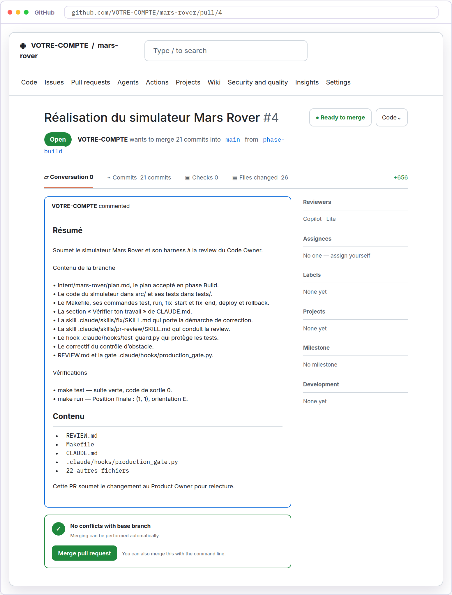

02

### Examinez les modifications.

Ouvrez l’onglet Files changed pour examiner le build tel qu’il est proposé. Le diff doit porter le code du simulateur et ses tests, `plan.md`, le harness des phases Test et Deploy et le correctif, sans qu’aucun fichier de tests ait été modifié ni supprimé. Vérifiez que les constats retenus sont corrigés, que le rover reste immobile devant un obstacle comme `spec.md` le demande, et que les écarts à `plan.md` sont expliqués. Repérez les réserves qui empêchent le merge pour les reprendre avec Claude.

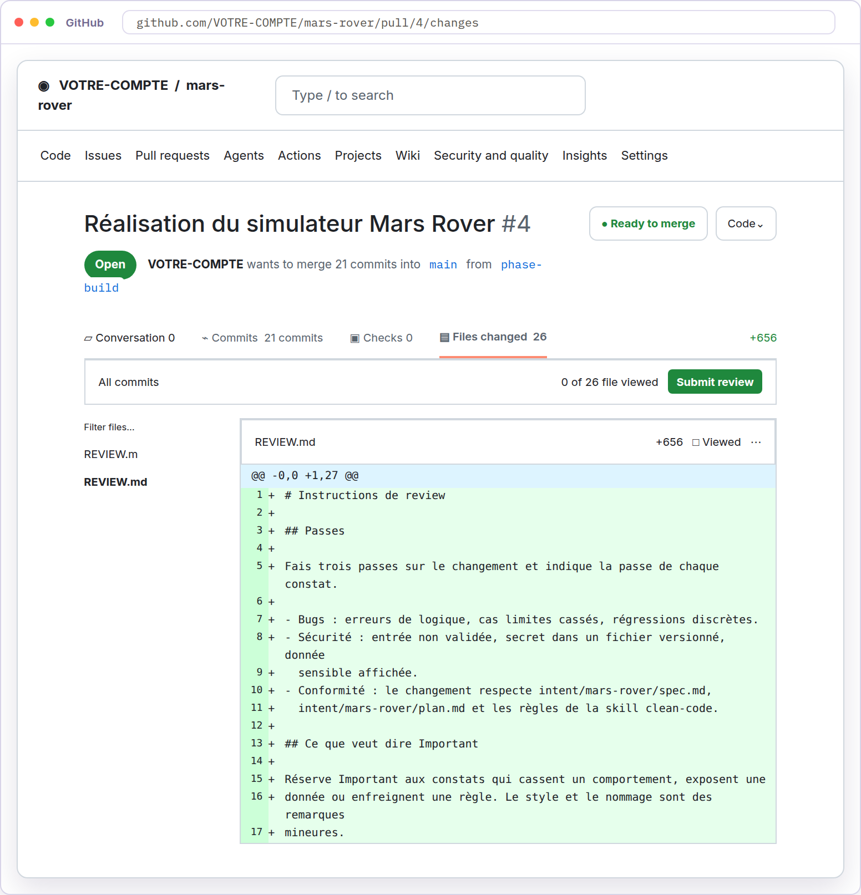

03

### Acceptez le build.

Décidez si le build permet de préparer la livraison. Si vous voulez des corrections, revenez dans la session `Réaliser la review` par la barre latérale. Demandez-les avec la skill `fix`, comme dans la leçon précédente, puis examinez la pull request mise à jour.

Lorsque vous acceptez le build, revenez dans l’onglet Conversation. Descendez jusqu’au bouton Merge pull request, cliquez dessus, puis confirmez avec Confirm merge.

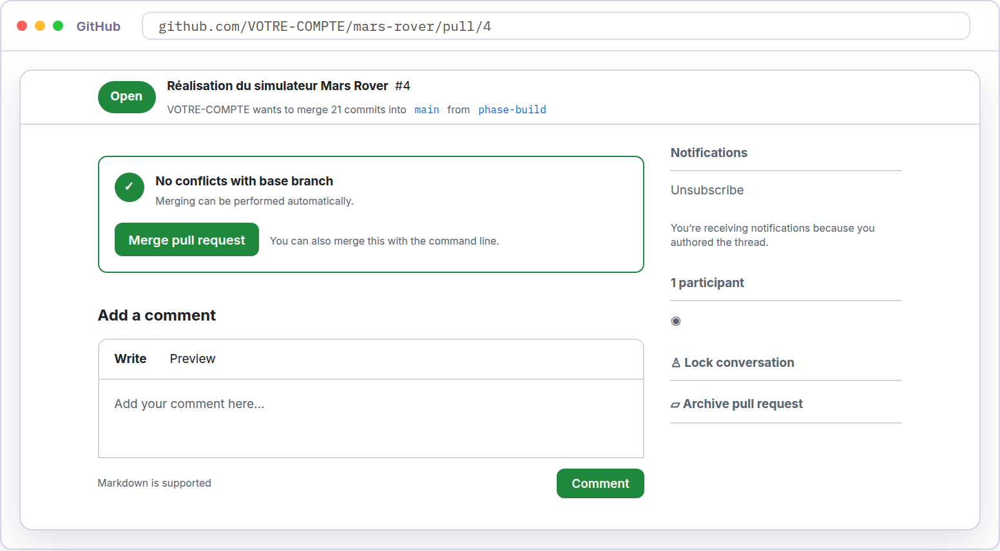

Le merge enregistre votre décision. Le simulateur, ses tests et son harness sont disponibles dans `main`. Le merge n’est pas une mise en service.

Application en entreprise

L’auteur et la personne qui approuve sont distincts. Dans un exercice individuel, prendre successivement leurs rôles ne reproduit pas cette séparation des responsabilités et ne permet pas d’approuver sa propre pull request dans GitHub. Le dojo distingue donc la décision pédagogique de merge d’une approbation indépendante imposée par la protection de branche, les règles du repository qui peuvent exiger des contrôles et des approbations avant un merge.

Un Platform Engineer qui veut conditionner le merge aux constats lit les comptes de gravité que le contrôle publie sous forme exploitable. La protection de branche conserve l’approbation humaine.

---

## Préparer la livraison

Définition à connaître avant de commencer

**Rollback** : retour à un état antérieur utilisable après une livraison qui pose problème.

Le build a été examiné et mergé dans `main`, avec les critères de review et la gate de production. Vous prenez le rôle du Release Manager.

Une version mergée n’est pas encore une version livrée. Avant de la mettre en service, l’équipe doit savoir quel commit livrer, dans quel environnement, avec quelles vérifications et comment revenir en arrière si le résultat n’est pas acceptable.

Le play *CICD integration and deployment* du playbook confie la mise en production à une autorisation explicite. Claude prépare les éléments de livraison, puis le Release Manager décide en s’appuyant sur la version, les vérifications et un rollback essayé. Le rollback doit être le chemin le plus répété du pipeline, une commande que l’agent peut lancer et qui est exercée régulièrement en préproduction, car la phase Maintain le déclenche quand une mesure suivie sort de ses limites. Revenir au commit précédent ne prouve pas à lui seul que les données et le service pourront être rétablis.

Dans ce dojo, le rollback sera répété sur `staging` avant l’écriture du dossier. `release.md` identifiera ensuite la version candidate par le commit de merge et la reliera aux preuves disponibles, en distinguant les conditions remplies de celles qui restent ouvertes. Vous autoriserez enfin la mise en production en déposant votre nom, ce que la gate de production exige pour laisser passer. Les commandes de déploiement simulent, elles ne joignent aucune machine.

Passons à la pratique

## À vous de jouer

Objectif

Prendre le rôle du Release Manager et réunir dans `release.md` la version candidate, les vérifications et le chemin de rollback, afin de décider de la mise en production à la fin de la phase Deploy.

01

### Ouvrez une nouvelle session Claude Code.

Prenez le rôle du Release Manager pour préparer la livraison. Cliquez sur Nouveau dans la barre latérale. La nouvelle session doit utiliser l’environnement `Mars Rover`, le repository `mars-rover` et la branche `main`, qui porte désormais le build mergé.

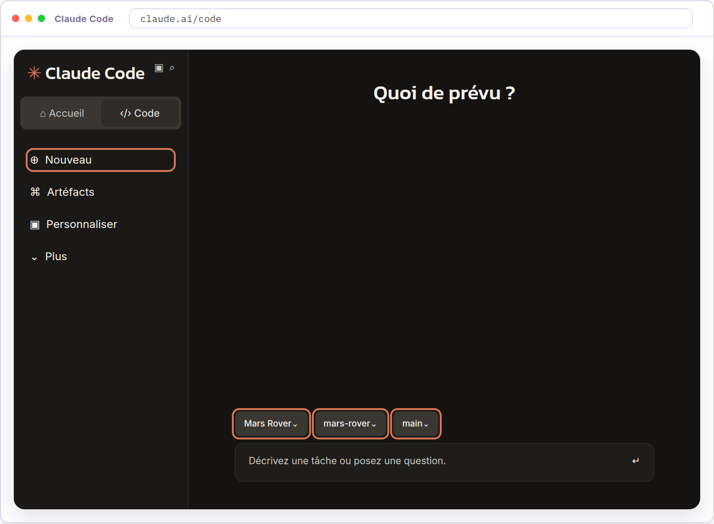

02

### Répétez le rollback sur `staging`.

Demandez à Claude de poser deux versions sur `staging`, puis de revenir à la première.

`Déploie sur staging. Crée ensuite un commit vide avec le message « Deuxième``version candidate », déploie de nouveau sur staging, puis lance le rollback``sur staging. Montre-moi la sortie de chaque commande.`

Un commit vide ne change aucun fichier, il sert ici à donner une seconde version à poser. Vérifiez que le deuxième déploiement nomme la version qu’il remplace, et que le rollback repose la première. La gate n’intervient pas, aucune de ces commandes ne vise la production.

03

### Préparez `release.md`.

Demandez à Claude le dossier qui relie le commit de merge aux vérifications disponibles et décrit les conditions de livraison. Le dossier rejoint `main` sans pull request.

`Rédige release.md à la racine du projet, le dossier de préparation de la livraison``du simulateur. Indique la version candidate, le commit de merge de la pull``request sur main. Liste les vérifications disponibles, make``test et make run, avec leurs sorties actuelles. Décris ensuite la cible de``production, l'autorisation attendue et le rollback, en distinguant ce qui est``établi de ce qui reste à définir ou à essayer. Ce projet n'a pas de cible de``production réelle, les commandes de déploiement simulent, le rollback vient``d'être répété sur staging, et la gate .claude/hooks/production_gate.py attend``le fichier release-approval.txt nommant le Release Manager. N'invente aucune``cible et ne déclare aucune livraison.``Commit ensuite uniquement ce fichier sur main avec le message « Prépare la``livraison du simulateur », puis push ce commit sur main vers GitHub.`

Claude doit reporter dans le fichier le commit de merge et les sorties des deux commandes, puis indiquer le commit créé et le push de la branche.

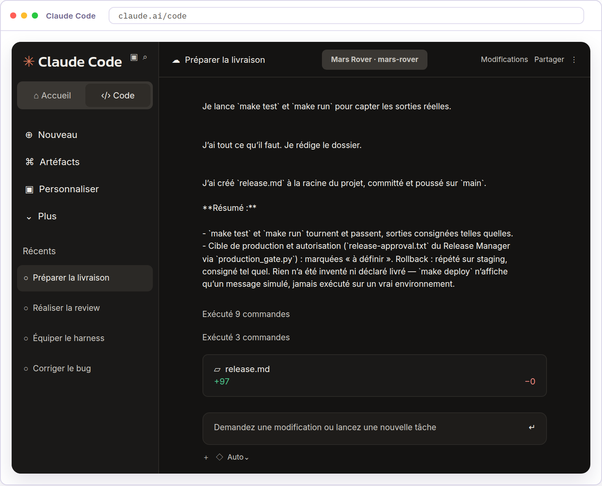

04

### Relisez `release.md`.

Dans le panneau Fichiers, ouvrez `release.md` à la racine du repository. La version candidate doit être le commit de merge que GitHub affiche sur la pull request, et les sorties reprises celles que Claude vient d’obtenir. La cible de production et l’autorisation du Release Manager doivent rester marquées à définir, et aucune livraison ne doit être déclarée. Si une condition est présentée comme remplie sans preuve, demandez la correction à Claude, qui enregistrera la version corrigée. Le rollback doit y figurer comme répété sur `staging`, et la mise en production comme non autorisée à ce stade.

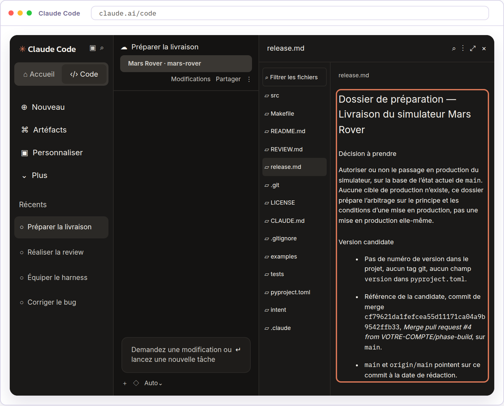

05

### Autorisez la mise en production.

Le dossier vous a donné la version, les vérifications et le chemin de retour. Vous décidez d’autoriser la mise en service. La gate de production attend un nom déposé dans le repository, pas un accord verbal.

`Crée release-approval.txt à la racine avec une ligne``« Mise en production de la version candidate autorisée par [votre nom], le``[date] ». Commit-le sur main avec le message « Autorise la mise en``production », puis push ce commit sur main vers GitHub. Relance ensuite``make deploy ENV=production et montre-moi le résultat.`

La gate laisse passer cette fois, et la cible affiche la version posée sur la production. C’est votre autorisation nommée qui a ouvert la gate, aucune ligne de code n’a changé. La phase Deploy se termine là, sur une mise en production simulée, décidée et tracée.

Application en entreprise

Le play demande la review des pull requests et les gates avant toute automatisation. Il demande aussi un runner, la machine d’exécution d’un pipeline, capable d’exécuter Claude sans interaction, un accès au modèle par l’API ou un fournisseur cloud, des outils MCP pour les cibles de déploiement et des machines d’exécution qui ne gardent aucun identifiant de production.

Le Platform Engineer commence par des étapes de jugement en lecture seule, analyser un build échoué, résumer un test instable ou rédiger les notes de version. Il ajoute ensuite des écritures derrière les gates existantes, corriger le lint, le contrôle automatique du style du code, mettre à jour une documentation générée ou traiter des commentaires de review.

Tout ce que l’agent écrit arrive en pull request par la protection de branche, sans accès direct à `main`, sous une identité d’agent et avec des accès temporaires. Le déploiement, la consultation d’état et le rollback deviennent des outils MCP autorisés par environnement.

L’autonomie est plus large en développement, intermédiaire en préproduction et soumise à l’autorisation nominative du Release Manager en production. Le dojo prépare la décision humaine dans `release.md`, sans pipeline.

Une équipe nomme aussi sa version candidate, par un tag Git posé sur le commit retenu ou par un champ de version dans le projet. Le dossier et l’autorisation désignent alors une version plutôt qu’un identifiant de commit. La session Claude Code du dojo ne peut pas poser ce tag, ses accréditations Git sont limitées à la branche qui lui est désignée et GitHub refuse l’écriture d’une référence de tag. Le dossier identifie donc la candidate par le commit de merge.
