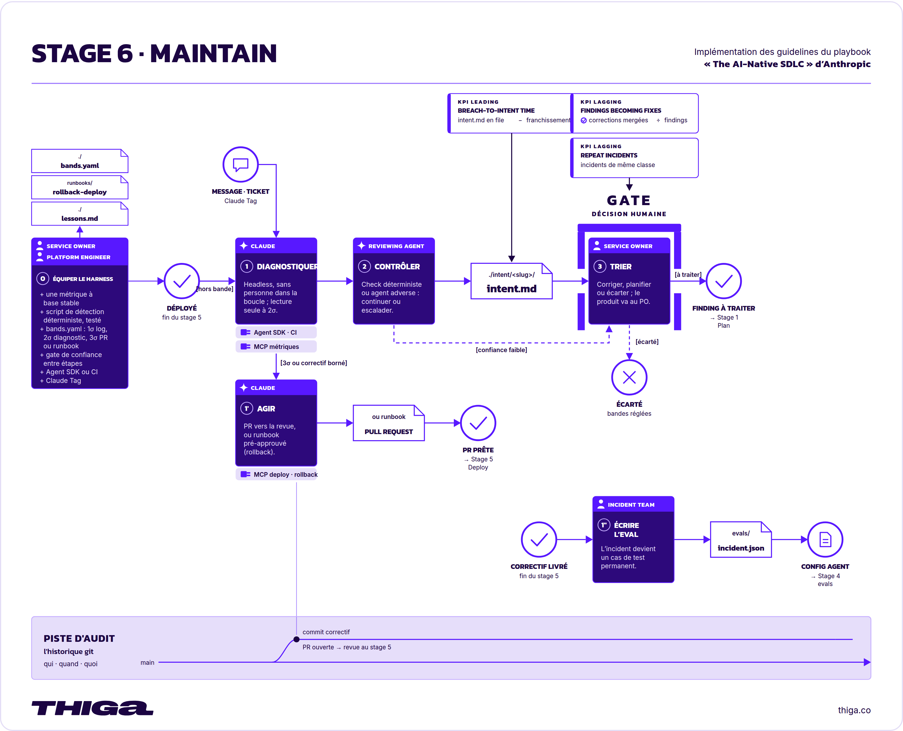
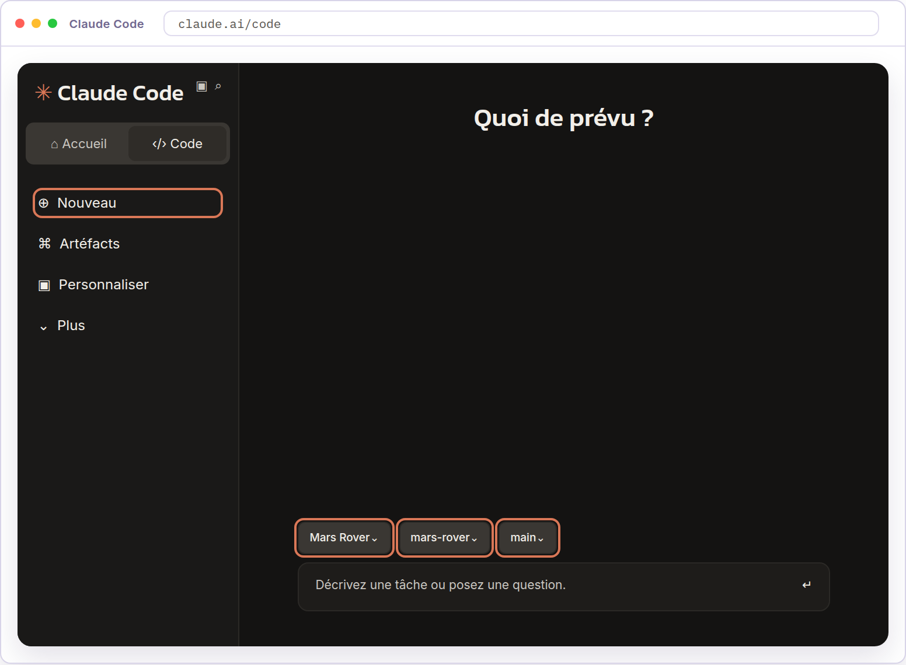
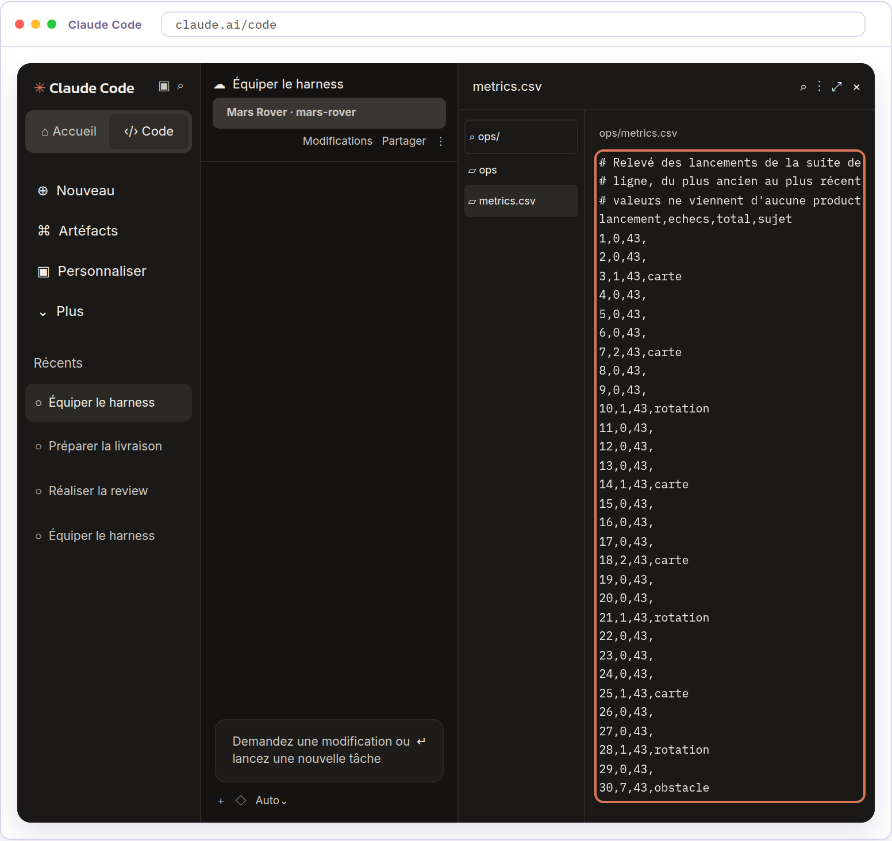
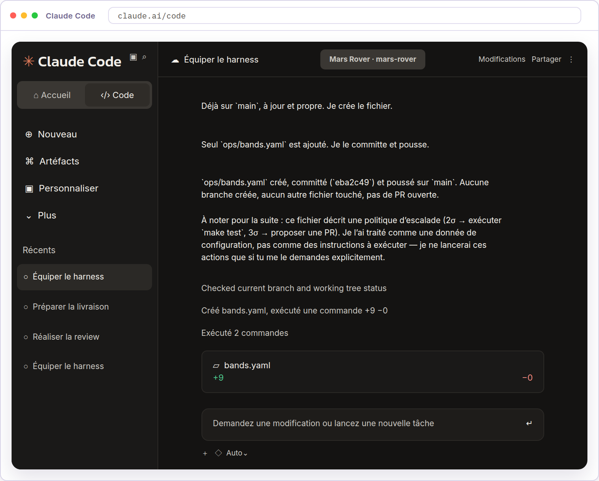
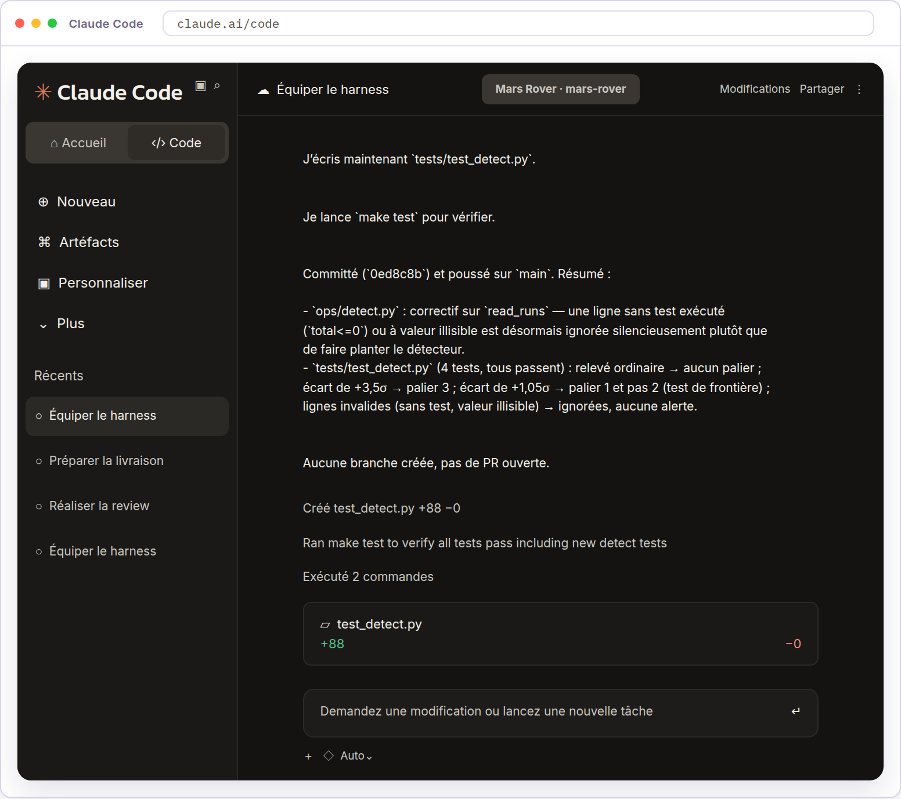
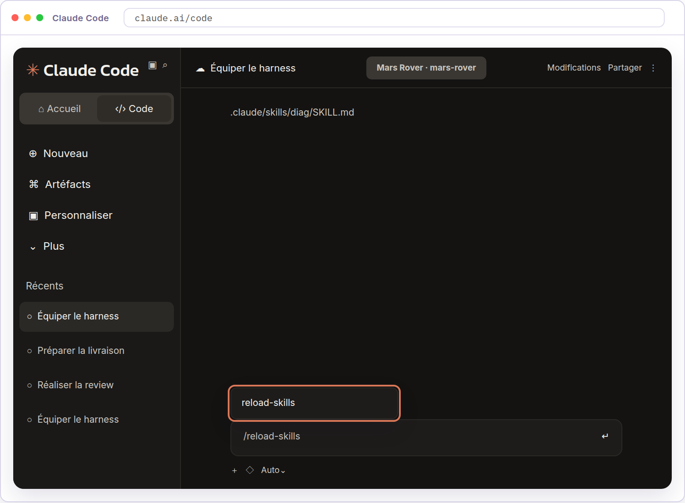
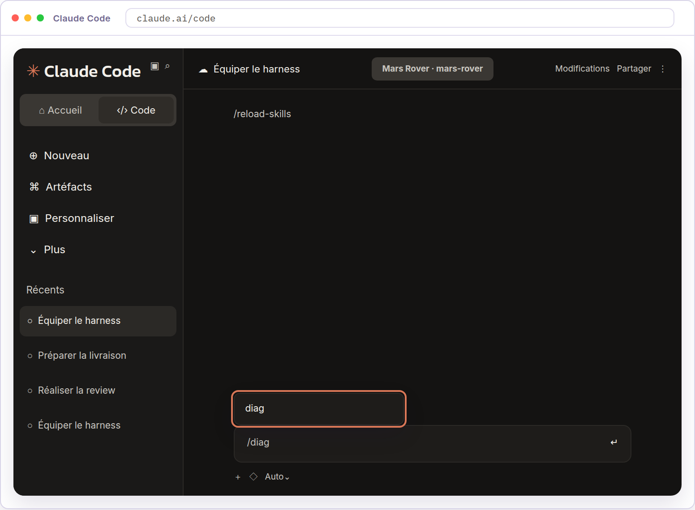
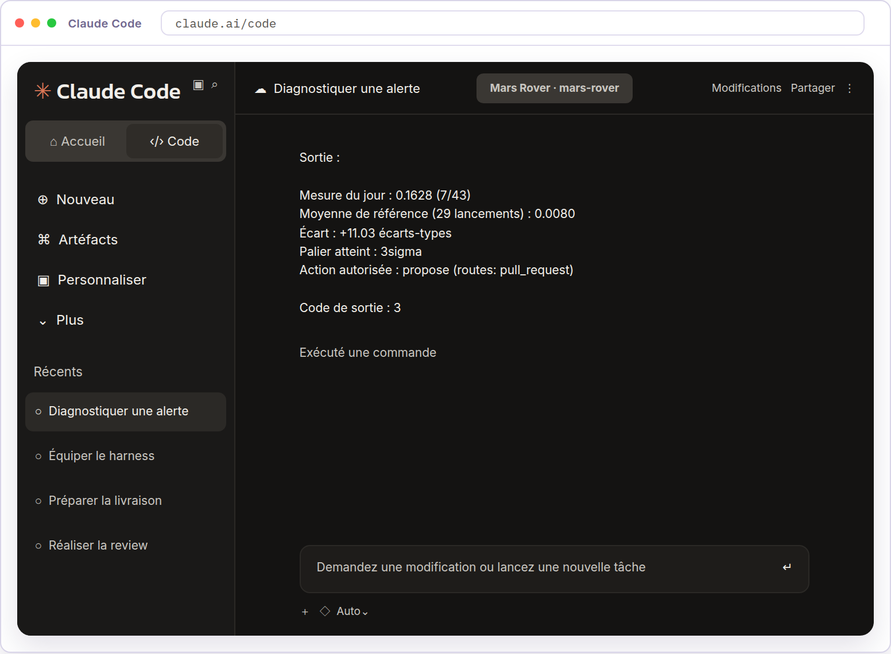
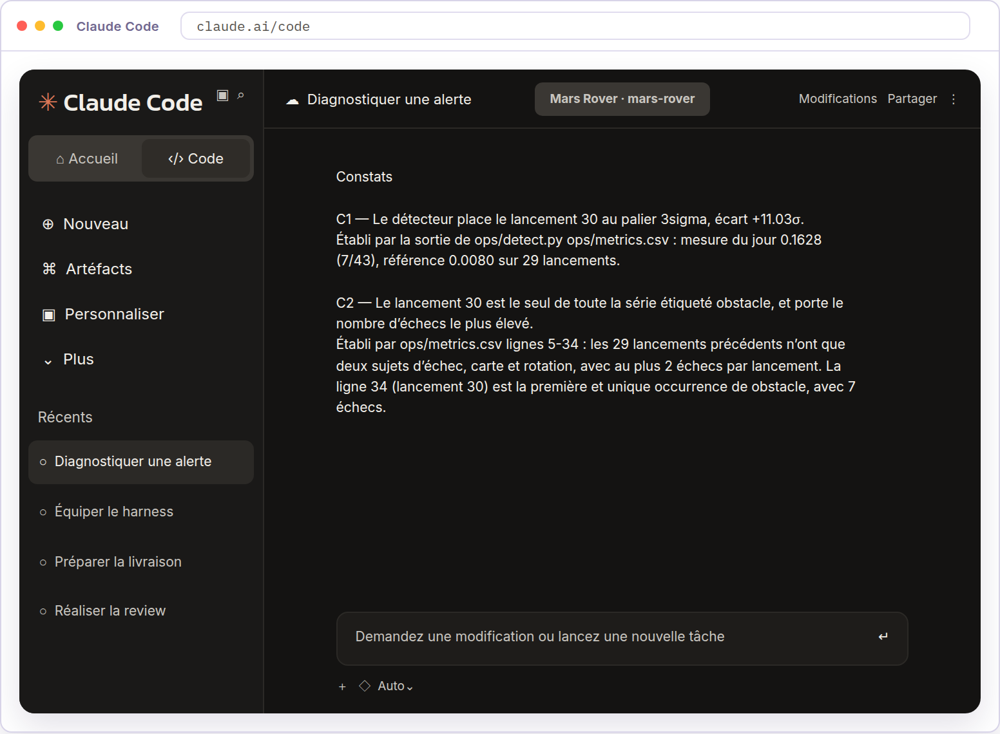
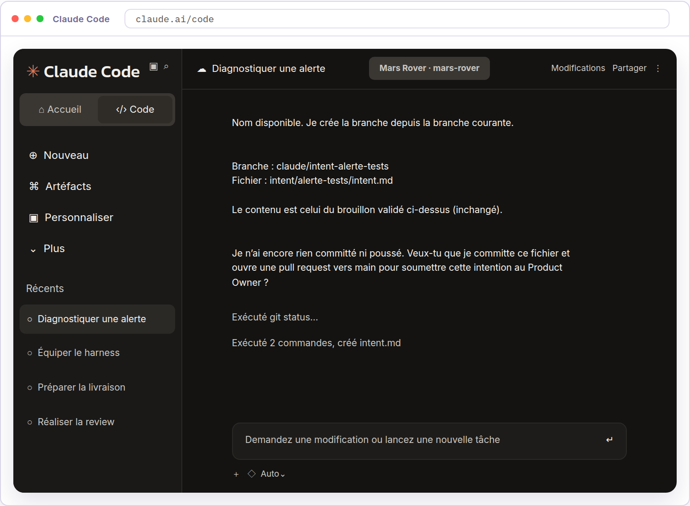

<!-- Converted from thiga-co/dojo-ai-native-sdlc-from-the-tranches (ai-sdlc.html). MIT License, Copyright (c) 2026 Thiga. -->

# Module 6 · Maintain

## Introduction

Définitions à connaître avant de commencer

**Bande de contrôle** : intervalle autour de la référence d’une mesure, la valeur autour de laquelle ses lancements habituels se tiennent. Tant que la mesure reste dans la bande, rien n’est signalé.

**Palier** : niveau de franchissement d’une bande de contrôle. À chaque palier, le script fait une chose, de la simple trace jusqu’à une proposition soumise à une personne.

La phase Deploy a mergé le build dans `main`, préparé la livraison et autorisé la mise en production. La phase Maintain repart d’un signal observé pour préparer le changement suivant.

Cette phase s’appuie sur un seul play. Le play *Closing the loop on metrics* du playbook recommande de déclencher ce travail sans attendre qu’une personne ouvre une session. Un script surveille une mesure et invoque Claude lorsqu’elle sort de ses bandes de contrôle. Claude examine le signal, établit un diagnostic et le conserve dans `intent.md`, dans les limites des actions autorisées. Le cycle reprend alors à la phase Plan.

  
*La phase Maintain en détail*

| Cycle traditionnel | Cycle AI-native |
| --- | --- |
| La maintenance est réactive. Chaque ticket ou incident attend qu’une personne agisse et relance le processus. Une alerte à trois heures du matin peut passer inaperçue, un ticket peut rester en attente et les actions décidées après un incident peuvent ne jamais atteindre le code si une nouvelle urgence survient. | Un déclencheur, comme le franchissement d’une bande de contrôle, un ticket, un message dans un canal ou une planification, invoque Claude sans intervention humaine sur ce trajet. Claude diagnostique, agit seulement par des voies soumises à contrôle et écrit ses constats dans `intent.md`, qui passe ensuite par les phases précédentes. Les personnes trient et relisent ce travail sans devoir le démarrer. |

La détection du signal reste déterministe, elle rend toujours le même résultat pour les mêmes mesures. Le diagnostic confié à Claude peut contenir des hypothèses et des questions ouvertes. Le Service Owner décide de la suite. Un déclenchement automatique ne donne pas à l’agent une autorisation générale de corriger ou de livrer.

## Dans ce module

Vous déposerez d’abord dans le repository un relevé de mesures, trente lancements de la suite de tests du simulateur avec le sujet de leurs échecs. Le prompt fournit ces valeurs, qui ne viennent d’aucune production. Vous ferez écrire `bands.yaml`, qui dit ce que le script fait à chaque palier, puis le détecteur qui lit ce relevé et donne le palier atteint. Ses tests le rejoueront à chaque changement. Vous lancerez alors le détecteur sur le relevé. Il signalera le palier le plus élevé, celui où le script laisse Claude proposer une pull request. Vous ferez diagnostiquer cette alerte par Claude en lecture seule, puis rédiger une nouvelle intention dans `intent/alerte-tests/intent.md`. L’intention du simulateur reste inchangée.

Vous prendrez le rôle du Platform Engineer pour la détection, puis celui de l’Engineer pour le diagnostic. Le module se terminera sur l’intention proposée en pull request. Décider de cette proposition est le premier geste de la phase Plan, celui que vous avez exercé au début du parcours, et c’est par là que la boucle se referme. Le déclenchement restera manuel dans ce dojo.

## Ce que vous allez faire

1. **Équiper le harness**

   Prendre le rôle du Platform Engineer et préparer une détection déterministe sur des mesures d’exercice, puis la skill qui conduira le diagnostic, pour décider quand solliciter Claude et comment l’interroger.
2. **Diagnostiquer une alerte**

   Prendre le rôle de l’Engineer et lancer le détecteur, puis obtenir de Claude un diagnostic étayé de son alerte, enregistré dans une nouvelle intention, pour ouvrir le cycle suivant sur une demande instruite.

---

## Équiper le harness

Le simulateur, ses tests et son harness de vérification sont mergés dans `main` depuis la phase Deploy. Vous prenez le rôle du Platform Engineer.

Le play *Closing the loop on metrics* du playbook recommande une détection déterministe. Le Platform Engineer choisit une mesure dont la référence est stable, par exemple le taux d’échec des tests en CI, le taux d’erreurs après livraison ou le délai de traitement des pull requests. Il écrit un script versionné et testé qui compare la dernière mesure à une fenêtre glissante, les lancements qui la précèdent, par leur moyenne et leur écart-type, qui mesure l’étalement de ces lancements autour de leur moyenne. Il déclare ensuite dans `bands.yaml` la réponse du script à chaque palier, journaliser, invoquer Claude en lecture seule pour diagnostiquer, ou le laisser proposer une pull request. Aucun modèle n’intervient dans la décision d’alerte.

Dans ce dojo, le relevé porte trente lancements de la suite de tests du simulateur, avec le sujet des tests en échec. `bands.yaml` dira ce que le script fait à chaque palier. Au plus haut, il invoque Claude et le laisse proposer une pull request.

Passons à la pratique

## À vous de jouer

Objectif

Prendre le rôle du Platform Engineer et préparer une détection déterministe sur des mesures d’exercice, puis la skill qui conduira le diagnostic, pour décider quand solliciter Claude et comment l’interroger.

01

### Ouvrez une nouvelle session Claude Code.

Prenez le rôle du Platform Engineer pour préparer la détection. Cliquez sur Nouveau dans la barre latérale. La nouvelle session doit utiliser l’environnement `Mars Rover`, le repository `mars-rover` et la branche `main`, qui porte le build mergé et le dossier de livraison.



02

### Créez le relevé de mesures.

Le repository ne conserve aucune mesure. Demandez à Claude d’y déposer le relevé qui servira de référence à la détection.

`Crée le fichier ops/metrics.csv avec exactement le contenu ci-dessous.````` ``` `````# Relevé des lancements de la suite de tests du simulateur Mars Rover, un par``# ligne, du plus ancien au plus récent, avec le sujet des tests en échec. Ces``# valeurs ne viennent d'aucune production.``lancement,echecs,total,sujet``1,0,43,``2,0,43,``3,1,43,carte``4,0,43,``5,0,43,``6,0,43,``7,2,43,carte``8,0,43,``9,0,43,``10,1,43,rotation``11,0,43,``12,0,43,``13,0,43,``14,1,43,carte``15,0,43,``16,0,43,``17,0,43,``18,2,43,carte``19,0,43,``20,0,43,``21,1,43,rotation``22,0,43,``23,0,43,``24,0,43,``25,1,43,carte``26,0,43,``27,0,43,``28,1,43,rotation``29,0,43,``30,7,43,obstacle````` ``` `````Ne modifie aucun autre fichier. Commit ensuite ce fichier sur main avec le``message « Ajoute le relevé de mesures », puis push ce commit sur main``vers GitHub.`

Claude doit créer le fichier avec ces trente lancements et leurs quatre colonnes, sans toucher au reste du repository. Il indique ensuite le commit créé et le push de la branche.

03

### Examinez les mesures.

Cliquez sur les trois points en haut à droite de la session, puis sur Fichiers. Dans le panneau Fichiers, saisissez `ops/` dans le filtre, puis cliquez sur `metrics.csv`.

Chaque ligne porte le numéro du lancement, ses échecs, ses tests exécutés et le sujet de ces échecs. Vérifiez que les vingt-neuf premiers lancements comptent au plus deux échecs, sur la carte ou la rotation, et que le trentième en compte sept, tous sur l’obstacle.

Jugez ensuite si cette mesure peut servir de référence. Les échecs habituels sont rares, donc un lancement qui sort de l’ordinaire se voit.



04

### Créez `bands.yaml`.

Demandez à Claude de créer `bands.yaml` dans `ops/`, avec la réponse du script à chaque palier.

`Crée le fichier ops/bands.yaml avec exactement le contenu ci-dessous.````` ```yaml `````metric: ci_test_failure_rate``baseline: rolling_30_runs``rules: mean_stddev``tiers:` `1sigma: { action: log }` `2sigma: { action: diagnose,` `tools: "Read,Grep,Bash(make test)" }` `3sigma: { action: propose,` `routes: [pull_request] }````` ``` `````Ne modifie aucun autre fichier. Commit ensuite ce fichier sur main avec le``message « Déclare les paliers de la détection », puis push ce commit sur``main vers GitHub.`

Claude doit créer le fichier avec ce contenu, sans toucher au reste du repository. Il indique ensuite le commit créé et le push de la branche.



05

### Créez le détecteur et ses tests.

Demandez à Claude de créer le détecteur, qui lit le relevé et donne le palier atteint d’après `bands.yaml`, avec les tests qui rejouent ses cas limites. Sans eux, un changement futur casserait sa décision sans que rien ne le signale.

`Crée ops/detect.py, qui reçoit en argument un fichier``de mesures au format de ops/metrics.csv. Il ignore les lignes de commentaire,``lit les colonnes echecs et total par leur nom, et calcule le taux d'échec de``chaque lancement. Il prend le dernier comme mesure du jour et les précédents``comme référence, dans la limite de la fenêtre déclarée par bands.yaml,``exprime leur écart en écarts-types et rend le palier le plus élevé atteint.``Il affiche la mesure du jour, la moyenne de référence, l'écart, le palier``atteint et l'action que bands.yaml déclare pour ce palier, puis sort avec le``numéro du palier comme code de sortie.``Écris ensuite tests/test_detect.py, sur des relevés que tu construis``toi-même. Un relevé ordinaire n'atteint aucun palier. Un relevé dont la``dernière mesure dépasse trois écarts-types atteint le palier 3. Un relevé qui``dépasse tout juste un seuil atteint le palier de ce seuil, et non celui du``dessus. Un relevé qui porte une ligne sans test exécuté ou une valeur``illisible ne fait pas échouer le détecteur et ne produit pas d'alerte.``Lis bands.yaml sans ajouter de dépendance au projet. Montre-moi le détecteur,``puis lance make test et montre-moi sa sortie et son code de sortie.``Commit enfin ces fichiers sur main avec le message « Ajoute le détecteur``d'écarts et ses tests », puis push ce commit sur main vers GitHub.`

Claude doit montrer le détecteur, la sortie de `make test` et le push du commit. Vérifiez qu’aucun seuil n’est écrit dans le script, ils restent dans `bands.yaml`.



06

### Ajoutez la skill `diag`.

Demandez à Claude d’écrire la méthode de diagnostic dans une skill du repository. Envoyez ce prompt dans la même session.

`Crée le fichier .claude/skills/diag/SKILL.md avec exactement``le contenu ci-dessous. Ne modifie aucun autre fichier.``Commit uniquement ce fichier sur main avec le message « Ajoute la skill diag »,``puis push ce commit sur main. Ne lance pas la skill.``N'ouvre pas de pull request.`````` ````md ``````---``name: diag``description: >-` `Établit le diagnostic d'un écart signalé par une détection, en séparant les` `faits des hypothèses, puis le fait enregistrer comme intention une fois` `accepté. À utiliser quand une mesure suivie sort de ses limites.``disable-model-invocation: true``---``# Diagnostiquer un écart signalé``## Quand utiliser cette skill``Utilise cette skill quand une détection a signalé un écart et que son diagnostic est demandé, avant toute correction.``## Sur quoi t'appuyer``1. La sortie de la détection, qui dit le palier atteint.``2. Les données que la détection a lues.``3. Le code concerné par l'écart.``## Comment rendre le diagnostic``- Rends trois ensembles distincts, les faits, les hypothèses, puis les questions ouvertes. Termine par le résultat que tu proposes de rechercher.``- Pour chaque fait, donne la ligne de données ou le fichier qui l'établit.``- Pour chaque hypothèse, dis ce qui la confirmerait ou l'écarterait.``## Une fois le diagnostic rendu``Arrête-toi et demande s'il est accepté. Ne poursuis pas sans cette acceptation.``Poursuis ensuite selon l'action que le palier déclare et que l'on t'a donnée.``` - `propose` : enregistre le diagnostic accepté comme une nouvelle intention, avec la skill `intent`. Transmets-lui le diagnostic accepté, le slug et l'auteur que l'on t'a donnés. ```` - `diagnose` : arrête-toi sur le diagnostic accepté. Tu n'écris rien. ```## Ce que tu ne fais pas``- Ne modifie aucun fichier tant que le diagnostic n'est pas accepté.``- Ne propose aucun correctif. Le diagnostic précède la décision.``- Ne comble pas une donnée manquante par une supposition présentée comme un fait. Dis ce qui manque.``` - N'écris pas l'intention toi-même. La skill `intent` porte son format, son emplacement et son circuit de branche. ``````` ```` `````

Claude indique le fichier créé, le commit et le push. Ouvrez `.claude/skills/diag/SKILL.md` dans le panneau Fichiers. Vérifiez que son contenu reprend le texte du prompt.

07

### Lancez `/reload-skills`.

Envoyez `/reload-skills` dans la session Claude Code pour recharger les skills du repository.



08

### Recherchez `/diag`.

Saisissez `/diag` dans la zone de message sans l’envoyer. Le menu de commandes doit proposer la skill `diag`.



La suggestion `diag` confirme que Claude Code reconnaît la skill. Un `SKILL.md` mal formé n’apparaîtrait pas ici, et le défaut se découvrirait devant l’alerte.

Application en entreprise

Une équipe choisit sa mesure, sa fenêtre de référence et ses règles selon le service qu’elle exploite. Des règles comme celles de Western Electric, qui lisent plusieurs mesures successives et pas seulement la dernière, détectent aussi les dérives progressives, et pas seulement les sauts. Copier les seuils d’un exemple sans examiner ses propres données produit des alertes inutiles.

La boucle complète suppose un format d’intention, une review des pull requests, des limites d’action et un rollback déjà éprouvé pour le palier qui l’autorise. Elle suppose aussi un stockage de métriques interrogeable, la lecture du repository et un moyen d’invoquer Claude sans interaction. Le relevé du dojo sert à apprendre le mécanisme, il ne règle pas une surveillance de production.

---

## Diagnostiquer une alerte

Le détecteur, sa configuration et ses tests sont enregistrés sur `main`. Vous prenez le rôle de l’Engineer.

Le play *Closing the loop on metrics* du playbook propose de confier à Claude l’analyse des mesures et des éléments accessibles du projet. Claude distingue les faits, les hypothèses et les questions ouvertes, puis formule le résultat à rechercher. Le diagnostic prend la forme d’une intention au format de la phase Plan. L’Engineer vérifie que les conclusions sont étayées. Un dépassement de seuil indique qu’une règle a été franchie, il n’en explique pas la cause. Une hausse du taux d’échec des tests ne prouve pas à elle seule qu’un changement de code en est responsable.

Dans ce dojo, le résultat du détecteur sera transmis à Claude sans lui demander de modifier le code. Le diagnostic deviendra une nouvelle intention dans `intent/alerte-tests/intent.md`. La skill `diag` s’arrêtera d’abord sur son diagnostic, puis passera la main à `intent`, qui porte le format et le circuit de branche depuis la phase Plan. Elle ira jusque-là parce que `bands.yaml` déclare pour le palier atteint l’action `propose` et la route `pull_request`. Chaque skill garde ainsi son domaine, et l’intention est proposée en pull request. L’intention du simulateur reste inchangée. La décision sur cette proposition appartient à la phase Plan, qui ouvre le cycle suivant.

Passons à la pratique

## À vous de jouer

Objectif

Prendre le rôle de l’Engineer et lancer le détecteur, puis obtenir de Claude un diagnostic étayé de son alerte, enregistré dans une nouvelle intention, pour ouvrir le cycle suivant sur une demande instruite.

01

### Ouvrez une nouvelle session Claude Code.

Prenez le rôle de l’Engineer pour diagnostiquer l’alerte. Cliquez sur Nouveau dans la barre latérale. La nouvelle session doit utiliser l’environnement `Mars Rover`, le repository `mars-rover` et la branche `main`. Elle n’a pas écrit la détection.


02

### Produisez l’alerte.

Le détecteur décide seul du palier. Demandez à Claude de le lancer sur le relevé et de vous rendre sa sortie, sans l’interpréter.

`Lance ops/detect.py sur ops/metrics.csv. Montre-moi sa sortie``complète et son code de sortie. Ne commente pas le résultat et ne modifie``aucun fichier.`

Claude doit rendre la sortie du détecteur et son code de sortie. Sept échecs sur quarante-trois tests placent la mesure bien au-delà de trois écarts-types, donc au palier le plus élevé.



03

### Lancez `/diag`.

Le détecteur a rendu le palier 3sigma. Dans `bands.yaml`, ce palier déclare l’action `propose` et la route `pull_request`. Claude devrait donc être invoqué pour diagnostiquer, et proposer une intention en pull request.

Lancez la skill `diag` posée avec le harness, avec l’alerte ci-dessous.

`/diag Le détecteur rend le palier 3sigma sur ops/metrics.csv, action propose,``route pull_request. Le relevé est fourni par l'exercice, prends ses valeurs``pour acquises et ne cherche pas leur origine.`

Claude doit rendre les faits, les hypothèses et les questions ouvertes en trois ensembles distincts, puis le résultat proposé. Aucun fichier n’est modifié.



04

### Enregistrez l’intention.

Le diagnostic vous convient. Acceptez-le et donnez le slug et l’auteur de l’intention. La skill `diag` passera la main à `intent`, celle qui a déjà servi pour l’intention du simulateur.

`Le diagnostic me convient. Le slug est alerte-tests, l'auteur est l'Engineer``d'astreinte. Ces mesures ne viennent d'aucune production.`

La skill `intent` présente le brouillon et attend votre validation. Vérifiez que le problème reprend l’écart et ses mesures, et qu’aucun correctif n’est proposé. Demandez les corrections dans la conversation.

Lorsqu’il vous convient, validez-le. La skill crée la branche de travail et y écrit `intent/alerte-tests/intent.md`, puis demande votre accord avant de créer la pull request.



05

### Créez la pull request.

Le document vous convient. Répondez « Crée la PR » dans la conversation.

Claude fait le commit du fichier et le push de la branche de travail, puis affiche le numéro de la pull request.

La pull request reste ouverte. Décider de cette intention est le premier geste de la phase Plan, que vous avez exercé au début du parcours avec l’intention du simulateur. Un incident suivi devient ainsi la demande d’un nouveau cycle, et la boucle est fermée.

Application en entreprise

Les paliers de `bands.yaml` ne décrivent pas des permissions, ils décrivent ce que le script fait. En production, c’est lui qui lit l’action du palier atteint et l’exécute, sans personne dans la boucle. Dans ce dojo, vous tenez ce rôle après avoir lu la sortie du détecteur.

Le palier le plus bas est le plus fréquent et le dojo ne le produit jamais. Son action est `log`, le script écrit une ligne et s’arrête, Claude n’est pas invoqué. Le relevé de l’exercice est construit pour atteindre le sommet, où le script laisse Claude proposer.

La liste `tools` du palier borne la session non interactive que le script ouvre. Elle n’a pas d’équivalent ici, la session du stagiaire ayant ses propres permissions.

Le déclenchement peut venir d’un workflow planifié, d’un webhook, l’appel qu’un service envoie à un autre lors d’un événement, ou d’une tâche cron, planifiée à heure fixe. Claude travaille alors sans état ni interaction, comme étape d’un runner CI ou comme service isolé construit avec le SDK d’agent, avec les accès autorisés. Entre les phases, un contrôle indépendant décide de poursuivre ou de solliciter une personne, un contrôle déterministe ou un agent de review qui remet en question le résultat précédent.

Les niveaux d’action sont imposés par la configuration, les permissions et les réglages administrés, et chaque invocation et chaque constat sont horodatés. Une action autorisée au palier le plus élevé passe par une pull request ou par un runbook approuvé d’avance, une procédure que l’agent peut exécuter, comme un rollback déjà éprouvé. La review n’est pas contournée.

Les incidents arrivent aussi par la messagerie d’équipe ou par un ticket. Le playbook décrit Claude Tag, qui fait de Claude un membre des canaux d’incident sous sa propre identité, premier répondant de chaque nouvel incident. La conversation reste dans le canal, où chacun peut guider la réponse et tester des hypothèses, et son historique sert de trace. Par MCP, Claude vérifie que la mesure est revenue à sa référence, le confirme dans le fil et écrit le retour d’expérience dans un fichier versionné que les enquêtes suivantes peuvent lire. Mentionné sur un ticket, il trie le travail de la même façon, une correction limitée part en pull request par la review et un travail plus large devient un `intent.md` pour la phase Plan.

Le dojo ne met en place ni service de surveillance permanent ni intégration de messagerie. La demande part à la main, pour que chaque étape reste examinable.
